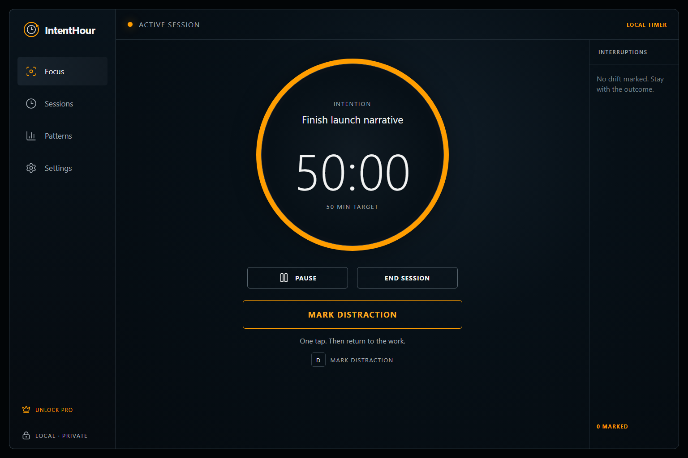
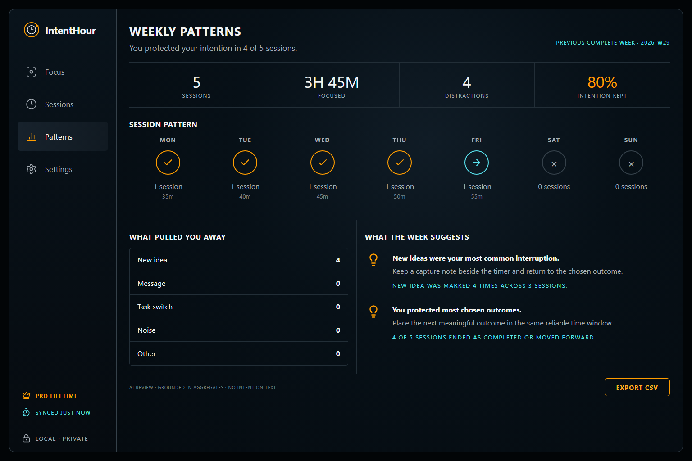
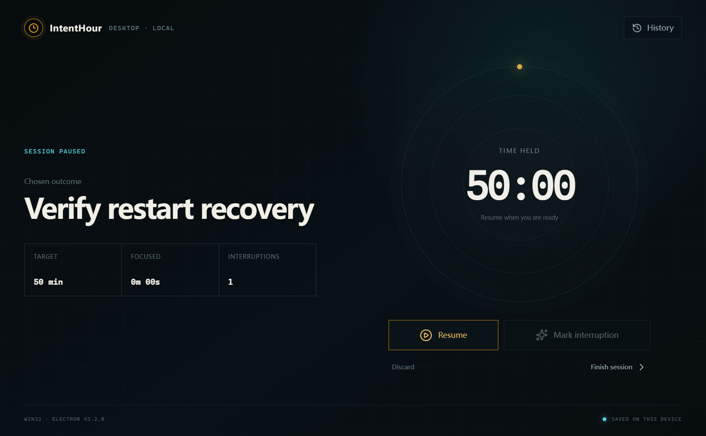
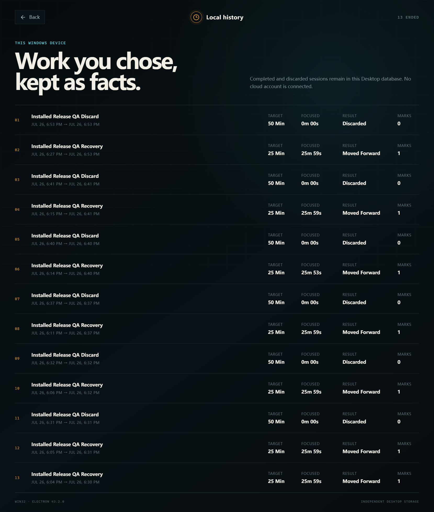
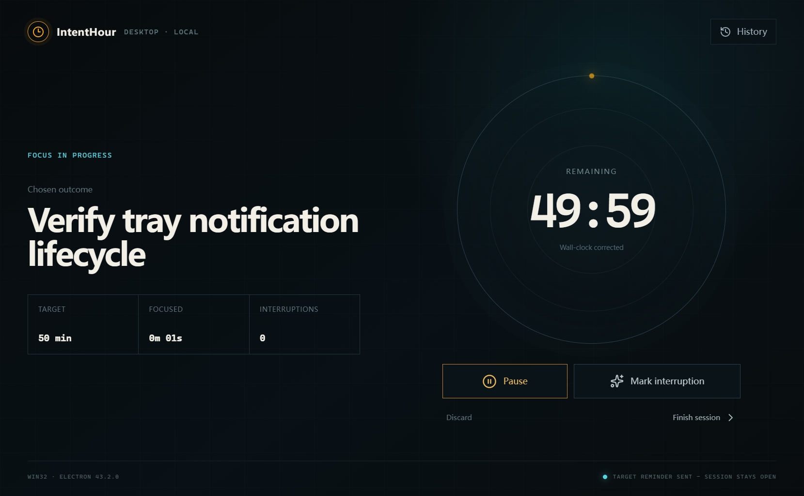
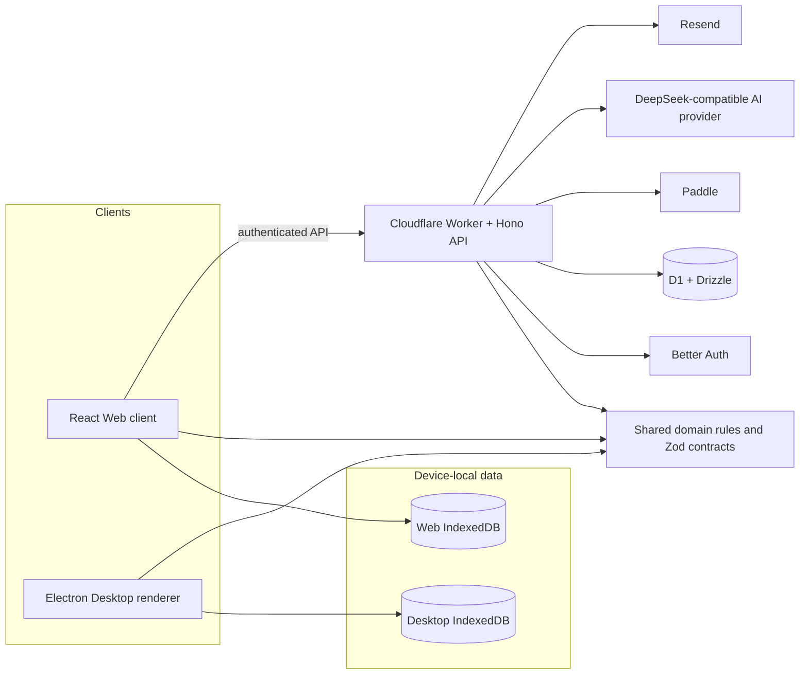

# IntentHour

> **Protect the work you chose.**

IntentHour is a local-first focus and reflection system for remote knowledge workers, available on the Web and as a Windows Desktop Preview. It records the outcome someone intended to protect, the interruptions that occurred, and the result—not only elapsed time.

**Web available · Windows x64 Desktop Preview published**

React · TypeScript · Cloudflare Workers · Electron · D1 · IndexedDB

## Quick links

- **Live Web app:** [intenthour.yates-33.top](https://intenthour.yates-33.top)
- **Windows Desktop:** [download the 1.0.0 Preview](https://github.com/Yates3/IntentHour/releases/download/desktop-v1.0.0/IntentHour-Setup-1.0.0.exe)
- **Demo video:** recording pending; use the [90-second demo script](docs/DEMO_SCRIPT.md)
- **Product case study:** [docs/PORTFOLIO_CASE_STUDY.md](docs/PORTFOLIO_CASE_STUDY.md)
- **Recruiter overview:** [docs/RECRUITER_OVERVIEW.md](docs/RECRUITER_OVERVIEW.md)
- **Architecture:** [docs/ARCHITECTURE.md](docs/ARCHITECTURE.md)
- **Security:** [docs/SECURITY.md](docs/SECURITY.md)
- **Deployment and release:** [docs/DEPLOYMENT.md](docs/DEPLOYMENT.md)
- **Desktop release notes:** [artifacts/showcase/release/desktop-preview-release-notes.md](artifacts/showcase/release/desktop-preview-release-notes.md)

## Product preview

### Web

| Focus workspace | Weekly patterns and AI review |
| --- | --- |
|  |  |
| The guest workflow keeps the intention, timer, interruption capture, and close-out in one view. | Pro history turns completed sessions into deterministic trends and an evidence-backed weekly review. |

### Windows Desktop Preview

| Restart-safe focus | Device-local history |
| --- | --- |
|  |  |
| Active state is restored from the Desktop database without an account. | Completed and discarded sessions remain on the Windows device. |



The Desktop main process owns the tray, close-to-tray lifecycle, single-instance behavior, and native target reminder. The screenshot shows the verified reminder-delivery state; it is not a mock notification.

## The problem

Traditional timers answer, “How long did I work?” They usually do not preserve what the user meant to accomplish, what pulled attention away, or what actually happened.

IntentHour treats a focus session as a small factual record: a chosen outcome, categorized interruption marks, and an end result. Local-first capture keeps the start cost low; cloud history and AI review are an optional reflection layer built from completed facts.

## Core workflow

```text
Set an intention
→ Focus
→ Record interruptions
→ Finish or discard
→ Review patterns
```

Active timers stay local to the device that started them. The Web account layer synchronizes ended Pro sessions; the current Desktop Preview deliberately remains local-only.

## Web and Desktop

| Capability | Web | Windows Desktop Preview |
| --- | --- | --- |
| Guest focus session | Yes | Yes |
| Local persistence | IndexedDB | Independent Desktop IndexedDB |
| Refresh/restart recovery | Browser reload and restart | Full application restart |
| Pause, resume, interruptions, finish, discard | Yes | Yes |
| Local history | Recent guest history | Device-local ended history |
| System tray / close to tray | No | Yes |
| Native target reminder | No | Yes |
| Account login | Google and magic link | Not implemented |
| Cloud history and ended-session sync | Pro Web accounts | Not implemented |
| Pro entitlement / CSV / AI weekly review | Yes | Not implemented |
| Offline focus after assets are available | Browser-dependent | Yes |

There is no real-time active-timer handoff between clients.

## System architecture



- `shared/` is framework-independent: both clients reuse the same focus-time and lifecycle semantics.
- Desktop active and ended data currently stays in its own local database.
- The Worker is the server boundary for identity, cloud ownership, Pro entitlement, CSV export, and AI review.
- Provider credentials and server secrets never belong in either client.
- No WebSocket, queue, Redis, Python service, SQLite layer, or automatic updater is represented because none is implemented.

## Engineering highlights

- **Local-first recovery:** wall-clock time and persisted Session state survive sleeping tabs, browser reloads, and Desktop process restarts.
- **Shared behavior, separate runtimes:** pure TypeScript domain functions prevent Web and Desktop from independently redefining pause, resume, finish, discard, interruption, start, restore, elapsed, and remaining-time rules.
- **Electron security boundary:** the renderer is sandboxed with context isolation, no Node integration, denied navigation/popups/permissions, and a small validated notification IPC allowlist.
- **Server-authoritative commerce:** browser checkout completion cannot grant Pro; verified, idempotent Paddle webhooks update D1 entitlement.
- **Grounded AI review:** only deterministic aggregates reach the provider. Zod validates output, server facts render evidence, and invalid output has a deterministic fallback.
- **Windows packaging:** Electron Forge and Squirrel generate a per-user x64 installer from a strict ASAR whitelist and local assets, including a Chinese-path-safe build wrapper.
- **Stable E2E isolation:** Playwright starts its own fixed-port Vite server using Node `22.23.1`; developers do not manually pre-start Vite.
- **AI coding context:** [AGENTS.md](AGENTS.md) defines sources of truth, dependency direction, security invariants, required validation, and prohibited changes.

## Important system decisions

- **Active timers remain device-local:** correctness and offline recovery do not depend on network availability.
- **Desktop starts local-only:** the first Desktop milestone proves native lifecycle value before expanding authentication and sync risk.
- **Electron over Tauri:** the current TypeScript/React/Vite skills and tooling are reused without introducing Rust for the first Windows client.
- **Shared domain rules instead of copied hooks:** client runtimes own UI and storage; business transitions remain portable.
- **One Worker instead of microservices:** current scale and boundaries do not justify operational fragmentation.
- **Desktop IndexedDB instead of immediate SQLite:** the existing Dexie model delivered restart-safe local storage without a premature native persistence layer.

See [ADR-001: Electron Desktop foundation](docs/adr/ADR-001-electron-desktop-foundation.md).

## Repository structure

```text
src/                  Web React client, browser storage, API clients
desktop/              Electron main/preload/renderer and local Desktop storage
shared/               Pure focus domain rules, Zod contracts, deterministic helpers
worker/               Hono API, auth, D1, billing, AI review, export, security
migrations/           D1 SQL migrations
tests/unit/           Domain, contract, storage, security, billing, AI tests
tests/e2e/            Web Playwright flows and API boundaries
tests/desktop/        Real Electron lifecycle tests
artifacts/showcase/   Public screenshots, release notes, demo and delivery package
docs/                 Architecture, security, deployment, case study and handoff
```

The repository has not been migrated into a workspace or cosmetic Monorepo.

## Local development

### Requirements

- Node.js 24+ and npm 11+
- Windows for Electron packaging and installed-app acceptance
- A Chromium-compatible browser

### Web and Worker

```powershell
npm.cmd install --legacy-peer-deps
Copy-Item .dev.vars.example .dev.vars
Copy-Item .env.example .env.local
npm.cmd run db:migrate:local
npm.cmd run dev -- --host 127.0.0.1 --port 4317
```

Open `http://127.0.0.1:4317`. Guest focus does not require provider credentials.

```powershell
npm.cmd run typecheck
npm.cmd run lint
npm.cmd run test
npm.cmd run test:e2e
npm.cmd run build
npm.cmd run cf-typegen
npm.cmd run deploy:dry
```

Playwright launches a clean fixed-port server itself with Node `22.23.1`; do not pre-start Vite for `test:e2e`.

### Windows Desktop

```powershell
npm.cmd run desktop:dev
npm.cmd run desktop:typecheck
npm.cmd run desktop:test
npm.cmd run desktop:smoke
npm.cmd run desktop:build
npm.cmd run desktop:package
npm.cmd run desktop:make
```

`desktop:make` creates the unpacked application and per-user Squirrel release files under `out/`. It does not publish them.

## Validation

Latest local validation for this showcase:

| Check | Result |
| --- | --- |
| TypeScript | Passed |
| ESLint | Passed with zero warnings |
| Unit tests | 19 files, 116 tests passed |
| Web Playwright | 37 passed, 5 intentionally skipped by project/viewport/provider conditions |
| Web build | Passed |
| Desktop Electron tests | 3 passed |
| Desktop smoke/build | Passed |
| Windows package | Squirrel x64 installer generated |
| Installed-app acceptance | Install, standard shortcut launch, single window, local-flow smoke, reinstall retention, and uninstall verified |

External OAuth, email, payment, AI-provider, SmartScreen appearance, and production-only paths still require the matching configured environment or manual acceptance. See [docs/HANDOFF.md](docs/HANDOFF.md).

## Windows Desktop Preview

- **Version:** `1.0.0`
- **Platform:** Windows x64
- **Installer:** `IntentHour-Setup-1.0.0.exe`
- **SHA-256:** `F2583D44F0993C3DDF5E60ABEBB57A0DF37E59D8F140145421F7B91E6F9FE5C7`
- **Release:** [IntentHour Desktop Preview 1.0.0](https://github.com/Yates3/IntentHour/releases/tag/desktop-v1.0.0)
- **Status:** Published as a GitHub prerelease
- **Signing:** unsigned; Windows SmartScreen may warn
- **Account:** not required
- **Data:** active and ended sessions stay in Desktop local storage
- **Cloud sync:** not implemented in the current Desktop Preview
- **Uninstall:** application registration, shortcuts, and processes are removed; Desktop `userData` is intentionally retained

Download the installer and `SHA256SUMS.txt` from the [same GitHub Release](https://github.com/Yates3/IntentHour/releases/tag/desktop-v1.0.0), then verify the checksum before installing.

## Privacy and security

- Active Session state is device-local.
- Desktop does not monitor screens, applications, browser activity, or keyboard content.
- The Desktop renderer uses `contextIsolation: true`, `nodeIntegration: false`, sandboxing, restrictive CSP, and validated narrow IPC.
- Server secrets are Worker-only.
- AI review requires consent and receives aggregate facts, not intention or note text.
- Paddle entitlement is server-authoritative.

Read [docs/SECURITY.md](docs/SECURITY.md) for the complete boundary.

## Current scope and limitations

Not implemented:

- Desktop account login, cloud history, Pro, billing, or AI review
- Web/Desktop ended-session synchronization
- Real-time active-timer handoff
- Teams, calendar integrations, browser extension, or mobile app
- Screen/application/keyboard monitoring
- Automatic Desktop updates
- Signed Windows distribution
- macOS or Linux release

## Roadmap

1. Design Desktop authentication without changing the local active-timer boundary.
2. Synchronize ended Sessions between Web and Desktop.
3. Add cross-client contract and integration tests.
4. Evaluate signed Windows distribution and auto-update.

## AI-assisted development

The repository—not chat history—is the engineering context. [AGENTS.md](AGENTS.md), shared contracts, ADRs, and tests constrain AI-assisted changes. AI supports implementation and investigation; product scope, architecture decisions, provider authority, security boundaries, and completion claims remain developer-managed and evidence-based.

## Further reading

- [Portfolio case study](docs/PORTFOLIO_CASE_STUDY.md)
- [Recruiter overview](docs/RECRUITER_OVERVIEW.md)
- [Project handoff](docs/HANDOFF.md)
- [Architecture](docs/ARCHITECTURE.md)
- [Security](docs/SECURITY.md)
- [Deployment](docs/DEPLOYMENT.md)
- [Maintenance](docs/MAINTENANCE.md)
- [Demo script](docs/DEMO_SCRIPT.md)
- [Project knowledge](docs/PROJECT_KNOWLEDGE.md)
