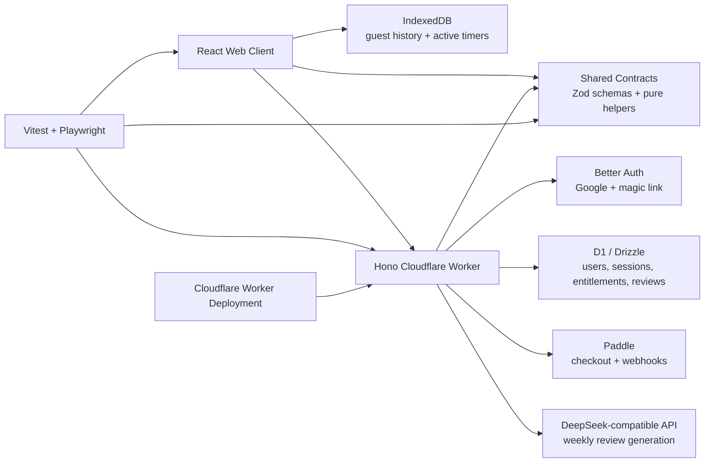
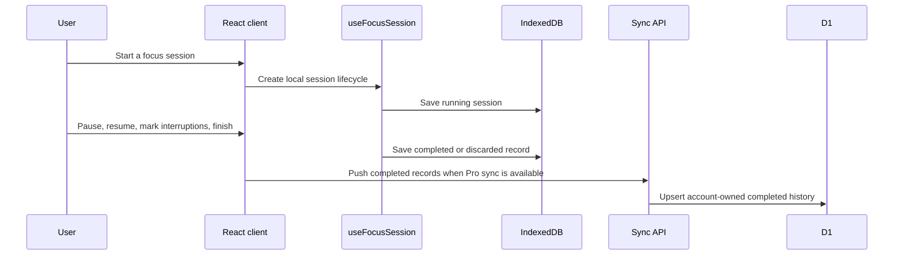
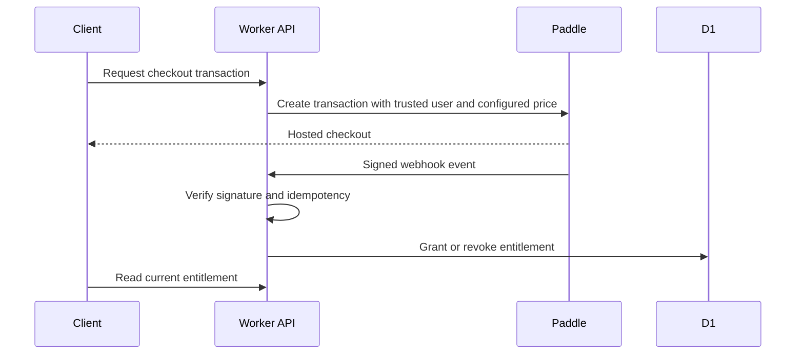
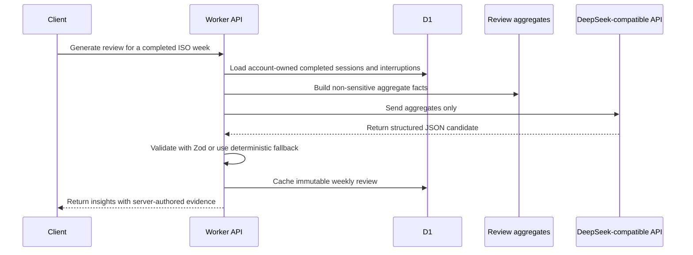

# IntentHour

> Product promise: **Protect the work you chose.**

IntentHour is a focus and reflection micro-SaaS for remote knowledge workers. A guest can start a recoverable local focus session without an account, record interruptions, and close the loop with an outcome. Pro Lifetime adds authenticated cloud history, CSV export, and one evidence-backed AI review for each completed ISO week.

The product is built around a simple question: did the work you chose at the beginning survive the session?

## Quick links

- Live staging app: [https://intenthour.yates-33.top](https://intenthour.yates-33.top)
- Architecture: [docs/ARCHITECTURE.md](docs/ARCHITECTURE.md)
- Deployment: [docs/DEPLOYMENT.md](docs/DEPLOYMENT.md)
- Security: [docs/SECURITY.md](docs/SECURITY.md)
- Maintenance: [docs/MAINTENANCE.md](docs/MAINTENANCE.md)
- Project knowledge: [docs/PROJECT_KNOWLEDGE.md](docs/PROJECT_KNOWLEDGE.md)
- AI agent instructions: [AGENTS.md](AGENTS.md)
- Visual implementation screenshots: [artifacts/visual/](artifacts/visual/)
- Visual reference specs: [docs/visual-spec/](docs/visual-spec/)

## Product preview


The core focus workspace keeps the chosen outcome, remaining time, pause control, session close-out, and interruption capture in one local-first view.

### Mobile interruption capture and weekly review

| Mobile interruption capture | Weekly patterns and AI review |
| --- | --- |
|  |  |

The mobile drawer supports one-tap interruption logging. The weekly patterns view summarizes completed sessions, interruption categories, intention-kept rate, server-authored AI evidence, and CSV export for Pro users.

## Product problem and approach

Most timers can tell a worker how long they worked. They do not usually preserve the intention that made the session worth starting, or the interruptions that changed the shape of the work.

IntentHour narrows the workflow to three facts:

1. The concrete outcome the user chose before starting.
2. The interruption categories marked during the session.
3. The actual result recorded at the end.

Guest mode keeps the start cost low: the core loop works locally without registration or provider credentials. Pro features build on the user's completed focus history instead of producing generic AI advice detached from observed data.

## Current capabilities

### Guest workflow

- Start a focus session without an account.
- Restore an active session after refresh or browser restart.
- Pause and resume a session with paused time excluded from elapsed work.
- Mark interruptions by category: `message`, `new_idea`, `noise`, `task_switch`, and `other`.
- Complete or discard a session.
- Keep recent local history in IndexedDB with a seven-day cleanup rule for ended guest records.

### Authenticated and Pro workflow

- Sign in with Google OAuth or a five-minute, single-use email magic link.
- Sync completed focus sessions across browsers for Pro users.
- Store cloud history in D1, scoped to the authenticated user.
- Export account-owned session and interruption data as CSV.
- Purchase a one-time Pro Lifetime entitlement through Paddle.
- Generate one cached AI review for each completed ISO week when the user has consented and there is enough completed-session data.
- Delete the application account and related application data.

### Reliability and safety

- Paddle webhooks, not browser checkout events, are the source of truth for Pro entitlement.
- Webhook events are signature-verified against the raw request body and recorded idempotently.
- Full approved refunds and chargebacks revoke Pro entitlement; partial refunds are recorded for manual review.
- AI review output is Zod-validated and has a deterministic fallback.
- AI evidence is constructed by the server from computed facts instead of model-generated metrics.
- Cloud queries are scoped by server-derived `user_id`.
- Turnstile protects anonymous magic-link requests, and the Worker returns restrictive security headers.
- Unit tests and Playwright tests cover core local behavior, contracts, security helpers, API boundaries, and browser flows.

## System architecture



Runtime ownership is intentionally small: one Cloudflare Worker serves the React app and all `/api/*` routes. IndexedDB is the system of record for guest history and active timers. D1 is the durable system of record for authenticated cloud data, entitlements, webhook events, preferences, and cached weekly reviews.

## Core flows

### Focus session



### Pro entitlement



### AI weekly review



## AI Coding and context management

IntentHour is maintained as a product system, not just a collection of screens. The root [AGENTS.md](AGENTS.md) defines module boundaries, sources of truth, validation rules, prohibited actions, and completion-report expectations for AI-assisted changes.

Shared contracts reduce duplicated client/server definitions, while architecture, security, deployment, maintenance, and project-knowledge documents live in the same repository as the code. AI-generated changes are not treated as correct by default: they must be checked with TypeScript, linting, tests, and runtime verification appropriate to the modified area.

The repository should not be made more complex just to resemble a larger open-source project. Monorepo migration, microservices, queues, Docker, Kubernetes, or new languages should only be introduced when a real product boundary requires them.

## Repository map

```text
src/                 React UI, local database, focus timer, sync client, public pages
worker/              Hono API, Better Auth, D1 access, billing, AI review, security headers
shared/              Zod contracts, TypeScript types, deterministic facts, CSV helpers
migrations/          D1 SQL migrations generated for the current schema
tests/unit/          Unit coverage for pure helpers, contracts, local DB, AI, billing, security
tests/e2e/           Playwright coverage for browser flows and API-boundary behavior
docs/                Architecture, deployment, security, maintenance, visual specs, project knowledge
```

## Local development

Requirements:

- Node.js 24+
- npm 11+
- A recent Chromium-compatible browser

Install and start locally:

```powershell
npm.cmd install --legacy-peer-deps
Copy-Item .dev.vars.example .dev.vars
Copy-Item .env.example .env.local
npm.cmd run db:migrate:local
npm.cmd run dev
```

Open `http://localhost:4317`. The free guest workflow does not require Google, Resend, Paddle, Turnstile, or DeepSeek credentials.

On Windows, `Start IntentHour.cmd` can also start the local app. Keep the terminal window open while using the local site.

Never commit `.dev.vars`, `.env.local`, API keys, passwords, tokens, or private provider configuration.

The repository currently uses `--legacy-peer-deps` because Better Auth exposes an optional React Native/Lynx peer tree whose React 18 type peer conflicts with this web-only React 19 app.

## Validation

Use the scripts that exist in `package.json`:

```powershell
npm.cmd run typecheck
npm.cmd run lint
npm.cmd run test
npm.cmd run test:e2e
npm.cmd run build
npm.cmd run deploy:dry
```

- `typecheck` verifies TypeScript project references.
- `lint` runs ESLint with zero warnings allowed.
- `test` runs the Vitest unit suite.
- `test:e2e` applies local D1 migrations and runs Playwright.
- `build` runs TypeScript build plus the Vite production build.
- `deploy:dry` builds and performs a Wrangler dry-run deploy check without publishing.

Real Paddle, OAuth, email, DeepSeek, and production-environment behavior may still require manual provider verification. Do not describe local, mocked, or dry-run checks as proof of real provider success.

## Documentation

- [docs/ARCHITECTURE.md](docs/ARCHITECTURE.md): runtime shape, data authority, AI privacy boundary, billing state, and API routes.
- [docs/DEPLOYMENT.md](docs/DEPLOYMENT.md): Cloudflare environments, provider gates, staging notes, Paddle sandbox acceptance, and rollback.
- [docs/SECURITY.md](docs/SECURITY.md): authentication, Turnstile, Paddle signatures, data isolation, CSP, logging, and AI privacy controls.
- [docs/MAINTENANCE.md](docs/MAINTENANCE.md): weekly/monthly operations, AI review change rules, and incident priorities.
- [docs/PROJECT_KNOWLEDGE.md](docs/PROJECT_KNOWLEDGE.md): evolving project context, implementation notes, known issues, and handoff summaries.
- [AGENTS.md](AGENTS.md): AI coding boundaries, sources of truth, validation matrix, prohibited actions, and task completion format.

## Product boundary

IntentHour v1 is a US-market digital SaaS sold as a one-time `$39` IntentHour v1.x Pro Lifetime license through Paddle.

The current scope deliberately does not include subscriptions, team accounts, native desktop/mobile apps, browser extensions, calendar integration, screen/app/browser monitoring, advertising pixels, real-time cross-device active timer handoff, internal admin panels, or XorPay for the US launch.

## Status and limitations

- Active timers remain device-local; only ended records sync to cloud history.
- External provider flows such as real payment, OAuth, email delivery, DeepSeek generation, and production launch gates may require manual verification in the configured environment.
- The current repository does not include desktop apps, browser extensions, Python AI services, or microservices.
- Account deletion removes application-owned data through the app boundary; external legal and transaction records retained by Paddle are outside the app's deletion API.
- Public display assets currently exist as still screenshots in `artifacts/visual/` and visual references in `docs/visual-spec/`; no demo video or GIF is currently present in the repository.
