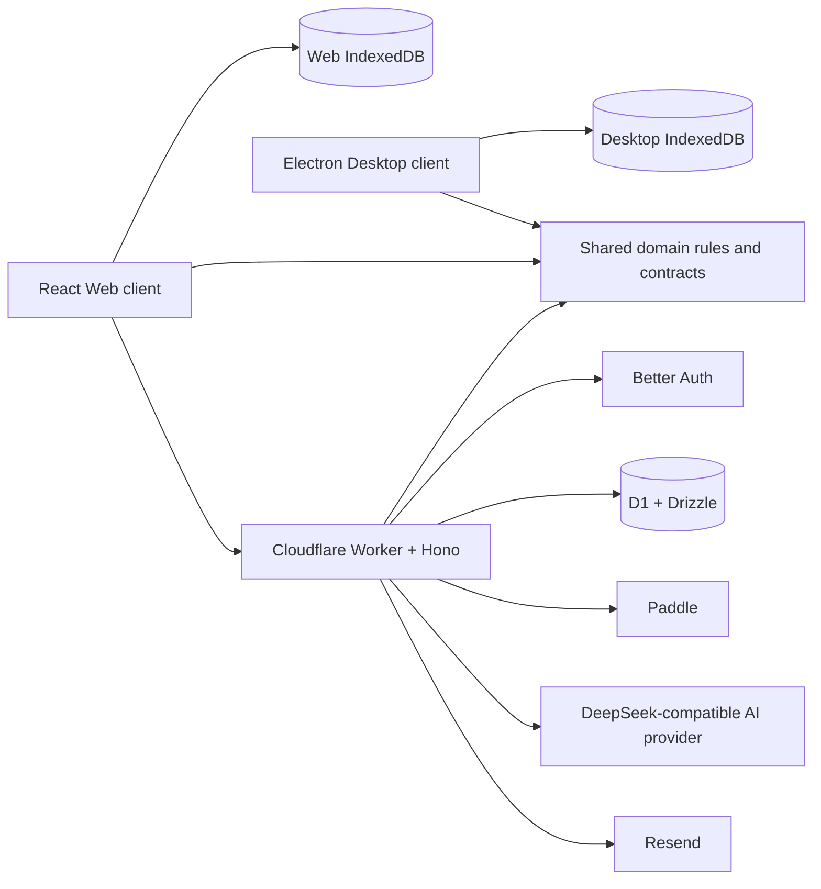

# IntentHour System Architecture

- Running and paused Sessions remain device-local.
- The current Desktop Preview has no cloud connection.
- The Worker owns identity, D1 ownership, entitlement, export, and AI-provider access.
- Provider secrets never enter Web or Desktop bundles.

Source of truth: [`docs/ARCHITECTURE.md`](../../../docs/ARCHITECTURE.md).
