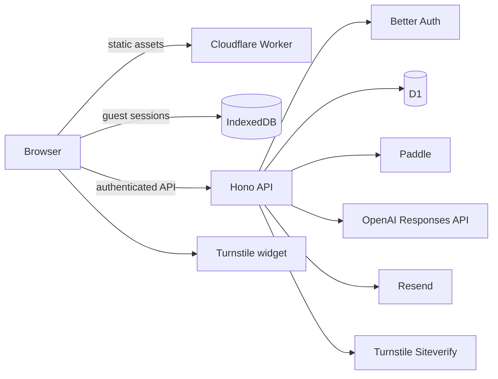

# Architecture

## Runtime shape

One Cloudflare Worker owns both the static React application and all `/api/*` requests. Cloudflare Static Assets serves the Vite client bundle; the Hono Worker runs first for API paths. D1 is the durable system of record for authenticated Pro data, while IndexedDB is the system of record for guests and active timers.

## Data authority

- Guests: completed records, interruptions, and active timer state stay in IndexedDB. Ended records older than seven days are removed; running and paused records are preserved.
- Pro users: completed records sync to D1. Active timers remain on the device that started them.
- Client-created business IDs are UUIDs. The API always derives `user_id` from the authenticated cookie and never accepts another account identifier from the body.
- Session conflicts use the latest ISO `updated_at`. Entitlements, Paddle events, and AI output are always server-authoritative.
- First Pro sync uploads only local completed records still inside the free seven-day window.

## AI privacy boundary

The model receives deterministic aggregates only: session counts, focused minutes, outcome totals, time buckets, and interruption-category counts. It never receives email, intention text, or free-text notes. The model selects two suggestions and fixed `evidenceKey` values; the API renders evidence from computed facts and caches the result permanently for that ISO week. Under three valid sessions, no model call is made.

## Billing state

The browser requests a transaction ID from `POST /api/billing/checkout`; the Worker embeds the authenticated user ID and configured price. A Paddle `checkout.completed` browser event only shows a pending state. Verified, idempotently recorded webhooks grant or revoke the entitlement. Full approved refunds and chargebacks revoke Pro; partial refunds are recorded for manual review.

## Key API routes

| Route | Authority | Purpose |
| --- | --- | --- |
| `/api/auth/*` | Better Auth | OAuth, magic link, callback and session |
| `POST /api/sync/push` | Pro server guard | Idempotent completed-record upload |
| `GET /api/sync/pull?cursor=` | Pro server guard | `(updated_at,id)` incremental pull |
| `POST /api/billing/checkout` | Authenticated server | Create trusted Paddle transaction |
| `POST /api/webhooks/paddle` | Paddle HMAC | Grant/revoke entitlements |
| `GET /api/me/entitlement` | Server | Current verified access |
| `GET/POST /api/reviews/:isoWeek` | Pro + consent | Read/generate cached review |
| `GET /api/export.csv` | Pro server guard | Stream account-owned history |
| `DELETE /api/me` | Authenticated server | Delete application account data |
