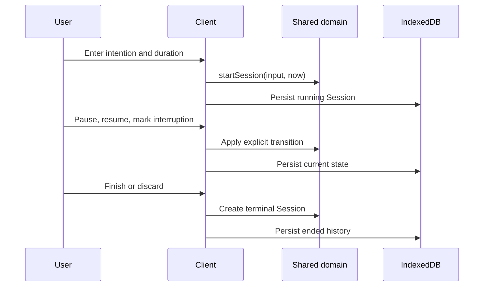
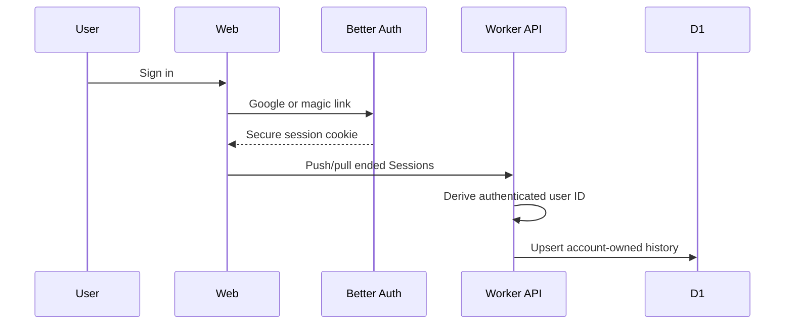
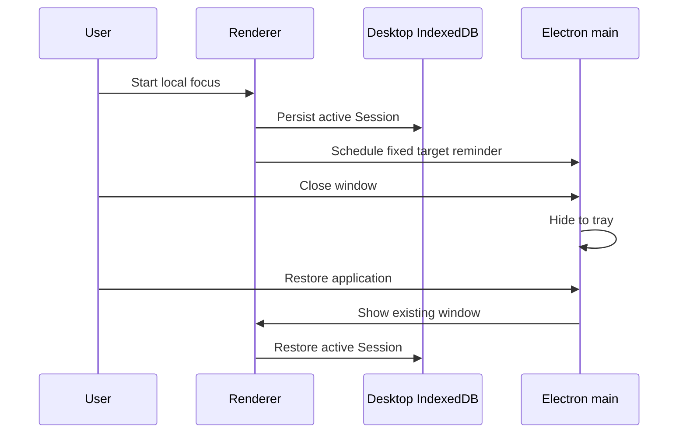
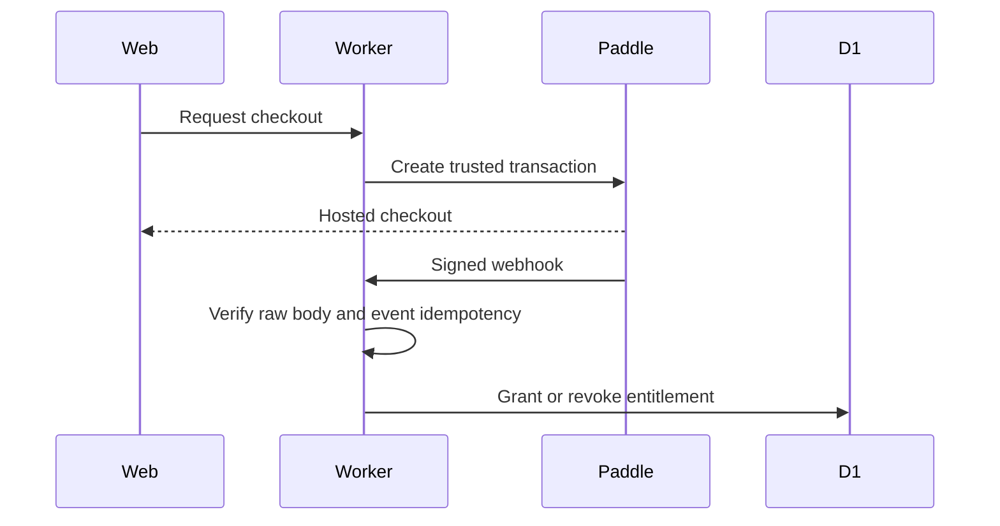
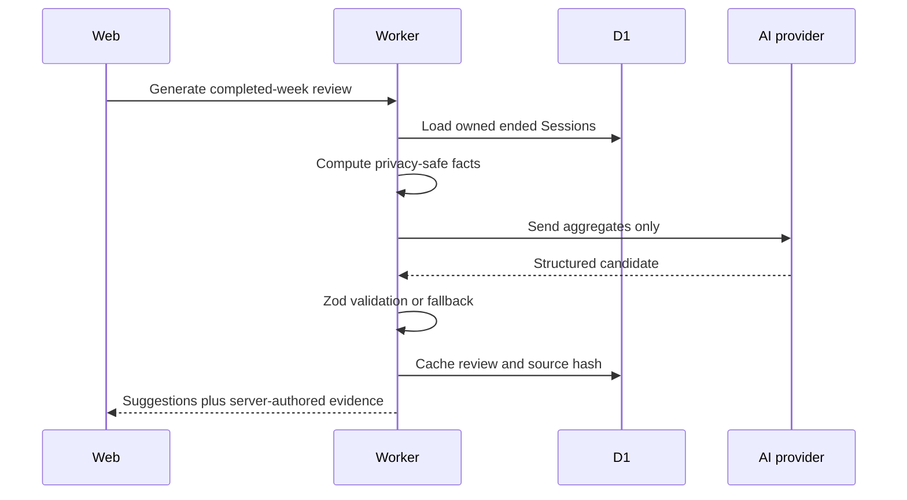

# IntentHour — Product and Engineering Case Study

## Executive summary

IntentHour is a local-first focus and reflection system for remote knowledge workers. It asks a narrower question than a conventional timer: did the outcome selected at the start survive the session?

The current product has two clients:

- A deployed React Web application where guests can complete the local focus loop and authenticated Pro users can synchronize ended history, export CSV, purchase a lifetime entitlement, and generate an evidence-backed weekly review.
- A published Windows x64 Electron Preview that provides an account-free, offline local focus loop with restart recovery, local history, system tray behavior, and a native target reminder.

Both clients reuse framework-independent TypeScript focus rules. A Cloudflare Worker owns the authenticated API, Better Auth, D1 data, Paddle entitlement, and AI-provider boundary. The repository also includes unit, browser, Electron, packaging, installation, security, deployment, and AI-coding context.

The system is intentionally not a Monorepo, microservice platform, activity monitor, or real-time timer relay. Complexity was added only when a second real client created a reuse boundary.

## Product problem

A timer can measure a block of time without preserving why the block mattered. A user might start with one outcome, respond to a message, pursue a new idea, switch tasks, and still finish with a technically complete timer.

IntentHour records three facts:

1. The concrete outcome chosen before work begins.
2. Interruption categories marked during the session.
3. The result selected when the session ends.

The local guest workflow removes registration friction. The reflection layer uses ended history rather than screen surveillance or generic productivity scoring. No claim is made about market size, user volume, revenue, or conversion because this repository does not provide evidence for those metrics.

## Product decisions

### Intention before measurement

The intention is the primary Session field. Duration supports the work but does not define success.

### One-tap interruption facts

Interruption categories are deliberately small: message, new idea, noise, task switch, and other. The product does not inspect windows, applications, browser history, or keyboard input.

### Explicit end result

A completed Session records one of four outcomes: completed, moved forward, changed direction, or blocked. A discarded Session remains a truthful terminal record instead of being silently removed.

### Active state stays local

Running and paused Sessions stay on the device that started them. This keeps reload/restart behavior reliable when connectivity changes and avoids ambiguous multi-device ownership. The Web cloud layer synchronizes ended Pro history. Desktop cloud synchronization is not implemented yet.

### Desktop proves native value before account scope

The first Desktop release focuses on system tray lifecycle, native reminder behavior, offline focus, and process restart recovery. Authentication, Pro, and sync are not included merely to make the clients appear symmetrical.

## System design

### Web client

`src/` contains the React/Vite client, browser Dexie database, focus hook, API clients, public pages, authentication surfaces, Paddle launcher, patterns, settings, and export entry points.

Web guests can complete the focus loop without provider credentials. Ended guest records are retained for seven days; running and paused records are not removed by guest cleanup.

### Desktop client

`desktop/` contains:

- Electron main-process lifecycle, single-instance lock, Tray, Notification, security handlers, and Squirrel event handling.
- A context-isolated preload bridge with fixed, validated notification operations.
- A React renderer that reuses shared domain rules.
- An independent `intenthour-desktop-v1` Dexie database.
- Focus, history, restart recovery, and native-lifecycle tests.

The Desktop renderer cannot access Node.js or arbitrary Electron APIs.

### Shared domain and contracts

`shared/` owns framework-independent behavior:

- Elapsed and remaining time.
- Start and restore.
- Pause and resume.
- Finish and discard.
- Interruption creation.
- Cross-module Zod contracts and serializable payloads.
- Deterministic review facts and CSV helpers.

React hooks and Electron renderer code orchestrate these rules rather than redefining them.

### Cloudflare API

One Cloudflare Worker serves static Web assets and Hono `/api/*` routes. It owns:

- Better Auth with Google OAuth and single-use magic links.
- D1/Drizzle persistence and migrations.
- Authenticated sync and ownership checks.
- Paddle transaction creation, raw-body webhook signature verification, idempotency, refunds, and chargeback entitlement changes.
- CSV export.
- AI weekly review consent, aggregation, provider request, Zod validation, deterministic evidence, fallback, and caching.
- Security headers, Turnstile validation, and account deletion.

The Worker remains one service because the current operational boundary does not justify independent services, queues, or network hops.

### Database and data authority

- Web guest and active timer state: Web IndexedDB.
- Desktop Preview state: independent Desktop IndexedDB.
- Authenticated ended Web history: D1.
- Pro entitlement: verified Paddle webhook events persisted in D1.
- Weekly review: immutable D1 cache for one completed ISO week.
- AI facts: deterministic server-side aggregation.

No client can grant its own entitlement or select another user ID.

### Authentication

Better Auth provides Google OAuth and five-minute single-use magic links. Login configuration, OAuth callback URLs, trusted origins, cookies, Turnstile, and provider secrets remain server concerns.

### Billing

The Web client requests checkout from the Worker. The Worker creates the Paddle transaction using configured price and authenticated identity. A browser checkout-completed signal can show pending state but cannot unlock Pro. The entitlement changes only after a verified, idempotent webhook.

### AI weekly review

The provider receives aggregate counts, durations, outcomes, time buckets, and interruption categories. It does not receive email, intention text, or free-text notes. The response must match a Zod schema. The server maps evidence keys to facts it computed, and a deterministic fallback handles unavailable or invalid model output.

### Local storage

Web and Desktop share repository contracts and behavior, not one physical database. This prevents Electron runtime and storage details from leaking into Web code while preserving compatible Session semantics.

### Windows packaging

Electron Forge packages Windows x64. Squirrel creates a per-user installer. The configuration:

- Uses a strict ASAR runtime whitelist.
- Excludes Worker/Web source, Playwright, test runtime switches, source maps, local databases, and environment files.
- Uses repository-owned icons and explicit Windows metadata.
- Stages resource editing in an ASCII-only temporary directory so Squirrel works when the repository path contains Chinese characters.
- Generates Release Notes and SHA256 beside the installer.

The current preview is unsigned and has no automatic updater.

## Key flows

### Guest focus flow

### Authenticated Web flow

### Desktop local flow

### Pro entitlement flow

### AI weekly review flow

## Technical challenges

### Extracting behavior from a React hook

The initial Web lifecycle lived inside `use-focus-session.ts`. Characterization tests first recorded current behavior. Time calculations, pause/resume, finish/discard, interruption creation, and start/restore were then extracted incrementally into pure shared functions. Each extraction retained compatibility instead of rewriting the whole hook.

### Local-first recovery

Intervals are unsuitable as a time authority because tabs sleep and processes stop. IntentHour uses explicit timestamps and wall-clock calculations. Paused time is settled through domain transitions and persisted state is restored on reload or restart.

### Electron security without generic IPC

The native reminder required communication across the renderer/main boundary. Instead of exposing `ipcRenderer`, shell, filesystem, or arbitrary text, the preload exports fixed schedule/cancel/delivery methods. Main validates sender identity, UUID Session IDs, trigger bounds, and fixed notification content.

### Windows packaging in a non-ASCII repository path

Squirrel's resource-editing tool failed when packaging directly from a path containing Chinese characters. A wrapper now performs Forge work under a unique ASCII directory, validates the intended output target, copies completed artifacts back, and removes only its own temporary directory.

### Playwright/Vite process stability

The Web E2E server previously exited unpredictably under the default Node 24 runtime on Windows. The Playwright configuration now starts the fixed-port Vite server through an isolated Node `22.23.1` package runtime, uses `127.0.0.1`, disables server reuse, and leaves no requirement for manual Vite startup.

### Cloudflare and local testing boundaries

Cloudflare Worker code, D1 migrations, browser E2E, and Desktop Electron testing have different runtime constraints. Dedicated TypeScript projects and scripts keep them independently verifiable without moving stable code into a workspace.

### Payment and AI secret boundaries

Paddle price, entitlement, webhook signature, AI provider key, OAuth secrets, and email credentials stay server-side. Tests validate the surrounding contracts and deterministic behavior without embedding secrets in fixtures or client bundles.

## Verified results

- A publicly reachable Web application.
- A working Windows Desktop local client.
- A generated Windows x64 Squirrel installer with SHA256 and Release Notes.
- Unit tests across domain, contracts, storage, security, billing, and AI behavior.
- Browser E2E for guest focus, API boundaries, Pro synchronization behavior, surfaces, and responsive views.
- Electron E2E for local focus, restart recovery, tray lifecycle, single instance, and target reminder state.
- Successful Web and Desktop production builds.
- Installed-app checks covering per-user installation, standard shortcut launch, data retention across reinstall, and clean registration/shortcut/process removal on uninstall.

Current numeric validation results are maintained in the root [README](../README.md) and generated showcase package after a fresh run.

## Lessons learned

- Complexity should be earned by a real boundary. A second client justified shared domain rules; it did not automatically justify a workspace migration.
- Characterization tests are safer than idealized rewrites when extracting behavior from a working product.
- Local-first correctness requires explicit time and persistence semantics, not a UI interval.
- Electron security is an API-design problem: a small preload contract is easier to reason about than a generic bridge.
- Packaging is part of product engineering. Paths, metadata, signatures, installation scope, shortcuts, user data, and uninstall behavior require runtime evidence.
- Stable tests and repository instructions are foundational for AI-assisted coding. Chat output is not a trustworthy source of truth.

## What I owned

This is an independently developed product system. My responsibilities included:

- Product definition and scope control.
- Web and Desktop interaction design.
- Full-stack system architecture.
- Shared domain extraction and contract design.
- Frontend/backend/provider integration.
- Electron security and local storage boundaries.
- Testing strategy and Windows E2E stabilization.
- Cloudflare deployment configuration.
- Paddle entitlement and AI privacy design.
- Windows packaging and release acceptance.
- AI-assisted implementation planning, review, and evidence-based verification.
- Architecture, security, deployment, maintenance, handoff, and showcase documentation.

## Current limitations

- Desktop authentication, Pro, cloud history, and ended-session synchronization are not implemented.
- Active Session handoff is intentionally not implemented.
- The Windows installer is unsigned and may trigger SmartScreen.
- No automatic updater, macOS build, or Linux build exists.
- The public Desktop GitHub prerelease is available; the demo video is still pending.
- The repository does not yet include an explicit open-source license; a license choice is a separate owner decision.
