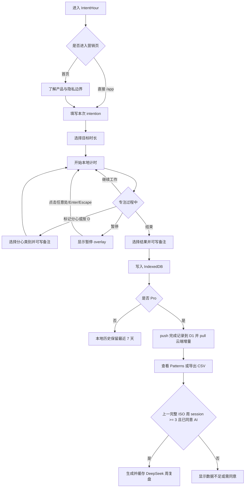
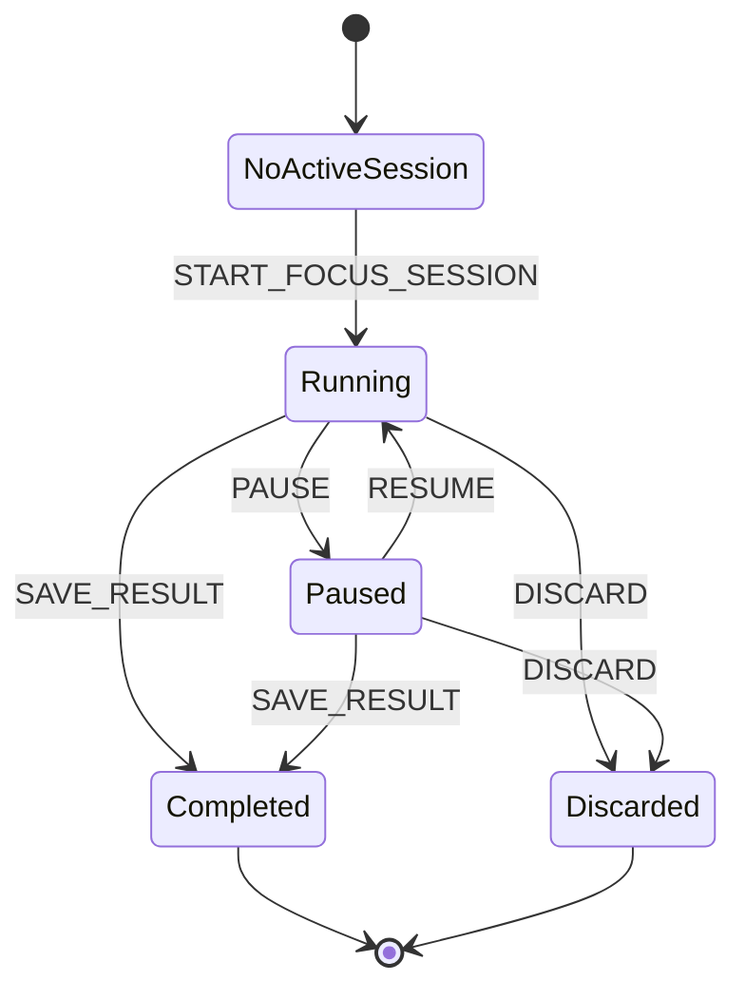
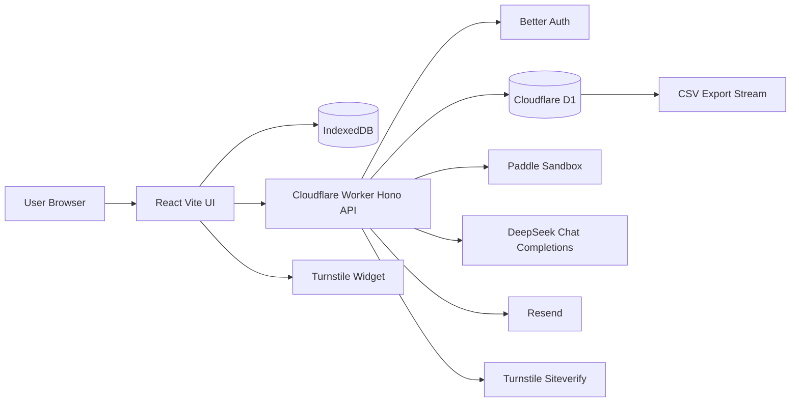

# IntentHour 项目知识档案

更新时间：2026-07-22
依据来源：当前代码、README、docs、wrangler 配置、最近 Git 记录、已执行的 staging 部署与冒烟检查。

## 1. 项目基本信息

| 项目 | 内容 |
| --- | --- |
| 项目名称 | IntentHour |
| 项目类型 | 面向美国远程知识工作者的专注复盘微型 SaaS |
| 当前状态 | staging 已部署到 Cloudflare，并已切换到自定义域名；Google Cloud Console 仍需加入新 OAuth 回调 URI |
| 开始时间 | 2026-07-18，可由初始 Git 历史与迁移/文档时间推断 |
| 最近更新时间 | 2026-07-22 |
| GitHub 仓库 | https://github.com/Yates3/IntentHour.git |
| 在线体验地址 | https://intenthour.yates-33.top |
| 正式域名 | 当前自定义域名为 `intenthour.yates-33.top`；生产商户审核状态待确认 |
| 当前版本 | package.json: 1.0.0；产品售卖口径为 IntentHour v1.x Pro Lifetime |
| 主要开发者 | 林ys 与 Codex 协作开发 |
| 目标用户 | 美国远程知识工作者、独立开发者、需要复盘注意力漂移的知识工作者 |

## 2. 一句话介绍

IntentHour 是一个专注于“本次工作成果是否被保护住”的专注复盘应用。它让用户先写下一个具体成果，再用本地可恢复计时、分心标记、结束复盘、云端同步和证据化周复盘，把一次工作从开始到结束留成可检查记录。

核心承诺：Protect the work you chose.

## 3. 项目背景

普通番茄钟主要记录“工作了多久”，但远程知识工作者真正难的是：一开始选择的工作是否被临时消息、新想法、噪音或任务切换打断。IntentHour 的产品观察是，专注问题不只发生在计时器结束时，而是发生在中途被拉走的那些瞬间。

项目最初目标是做一个真实可上线、可注册、可付款、可跨设备同步的英文 SaaS，而不是只停留在原型。它把注意力管理拆成三个可记录事实：本次意图、工作过程中的分心类型、结束时的真实结果。这样用户复盘时不需要凭感觉回忆，而是能看到本周被哪些因素拉走、哪些 session 保住了目标。

该项目也体现开发者自身的学习和成长路径：从产品边界、视觉基准、支付与认证、隐私边界、AI 接入、Cloudflare 部署到测试验收，一步步把“可展示项目”推进成可运行工程。

## 4. 产品目标

### 4.1 用户目标

用户可以在开始工作前明确一个具体成果，在工作中快速标记分心，在结束时记录真实结果，并在 Pro 版本中跨设备查看历史、导出 CSV、生成基于事实的周复盘。

### 4.2 产品目标

产品希望帮助用户形成一个轻量习惯：先选择工作，再保护工作，最后根据事实复盘，而不是用模糊的“今天效率怎么样”评价自己。

### 4.3 当前阶段目标

当前阶段目标是完成生产级 MVP：游客可完成本地完整流程，Pro 可通过 Google 登录、Paddle 沙盒付款、云端同步、CSV 导出和 DeepSeek 周复盘完成商业化演示。

### 4.4 暂不解决的问题

v1 不做订阅、团队账户、实时跨设备计时接力、浏览器扩展、原生 App、日历集成、屏幕监控、应用监控、广告追踪、内部管理后台、XorPay 美国首发支付、生产域名正式上线。

## 5. 核心用户场景

### 场景一：开始一次专注

用户进入 `/app`，在新 session 表单中填写 `INTENTION`，选择目标时长。目前 UI 提供 25、40、50、75、90 分钟选项，数据合同允许 5 到 240 分钟。点击 `START FOCUS SESSION` 后，客户端生成 UUID、deviceId、时间戳，并写入 IndexedDB。界面进入计时页，显示 intention、剩余时间、目标分钟数和当前状态。

主要代码：`src/features/focus/focus-page.tsx`、`src/hooks/use-focus-session.ts`、`src/lib/local-db.ts`。

### 场景二：记录分心

用户可以点击 `MARK DISTRACTION`，或在输入框未聚焦时按 `D` 打开抽屉。分心类别包括 `message`、`new_idea`、`noise`、`task_switch`、`other`，可附加最多 300 字备注。保存后写入 IndexedDB 的 `interruptions` 表，并在右侧 rail 里按时间展示。

分心记录不会暂停计时。它记录的是“发生过漂移”，不是惩罚用户。

### 场景三：暂停与恢复

用户点击 `PAUSE` 后，session 状态变为 `paused`，写入 `pausedAt`。桌面与移动端显示全屏暂停界面，点击任意位置、按 Enter 或 Escape 可恢复。恢复时会把当前暂停段加入 `totalPausedMs`，并清空 `pausedAt`。暂停期间计时显示保持不变。

主要代码：`togglePause()`、`PauseOverlay`、`elapsedMs()`。

### 场景四：结束专注

用户点击 `END SESSION` 打开结束对话框，选择结果：`completed`、`moved_forward`、`changed_direction`、`blocked`，可填写最多 500 字备注。保存后 session 状态变为 `completed`，记录 `endedAt`、`outcome`、`outcomeNote`，并清空当前活动 session。如果选择 `Discard session`，状态变为 `discarded`。

当前代码没有实现“时间到自动结束”；剩余时间归零后仍由用户手动结束。文档中必须标为当前限制。

### 场景五：查看和导出记录

游客可在 `/app/sessions` 查看本地最近记录；免费版本地清理 7 天前的已结束记录。Pro 用户可在 `/api/export.csv` 导出云端已完成 session 和 interruption 明细。CSV 字段包括 session id、intention、target minutes、started/ended at、outcome、outcome note、distraction category、distraction time、distraction note。

导出入口：Pro settings 页和 weekly patterns 页。

## 6. 当前已完成功能

### 营销页与暗色视觉系统

* 功能说明：实现首页、流程/隐私、定价、页尾和应用界面，采用近黑石墨背景、琥珀色主操作、冰青色状态色。
* 用户操作：从首页了解产品，进入 `/app` 或登录/升级。
* 主要代码位置：`src/components/marketing-site.tsx`、`src/styles/global.css`。
* 当前状态：已实现。
* 已验证结果：Vite build 通过，staging `/app` 返回 200。
* 已知限制：部分源码显示疑似 mojibake 文案符号，需要单独清理。

### 游客本地专注流程

* 功能说明：无需注册即可创建 session、计时、暂停、恢复、记录分心、结束复盘。
* 用户操作：进入 `/app`，填写 intention，选择时长，开始并完成 session。
* 主要代码位置：`src/features/focus/focus-page.tsx`、`src/hooks/use-focus-session.ts`。
* 当前状态：已实现。
* 已验证结果：Playwright 覆盖 guest restore/mark/complete 流程。
* 已知限制：当前没有自动完成或通知音。

### 本地 IndexedDB 持久化

* 功能说明：使用 Dexie 管理 `sessions`、`interruptions`、`meta`。
* 用户操作：刷新或关闭页面后重新进入 `/app`，活动 session 会恢复。
* 主要代码位置：`src/lib/local-db.ts`。
* 当前状态：已实现。
* 已验证结果：单元测试覆盖 7 天清理；E2E 覆盖刷新恢复。
* 已知限制：清除浏览器数据会删除本地数据；不同浏览器的游客数据不共享。

### 暂停界面

* 功能说明：暂停时显示全屏 overlay，冻结计时显示，点击任意位置恢复。
* 用户操作：点击 `PAUSE`，再点击页面任意位置或按 Enter/Escape。
* 主要代码位置：`PauseOverlay`、`src/styles/global.css`。
* 当前状态：已实现。
* 已验证结果：E2E 覆盖 pause、reload、resume、API 活动后不黑屏。
* 已知限制：暂停计时仍依赖系统时间戳，系统时间被用户手动大幅修改时没有额外校正。

### Google 登录与魔法链接框架

* 功能说明：Better Auth 支持 Google OAuth 和 5 分钟、哈希存储、单次使用的 magic link。
* 用户操作：进入 `/signin`，使用 Google 登录；magic link 需要 Resend 配置后可用。
* 主要代码位置：`worker/auth.ts`、`src/pages/sign-in-page.tsx`。
* 当前状态：Google staging 已验证；Resend 发送域名待确认。
* 已验证结果：Worker 现在生成 `https://intenthour.yates-33.top/api/auth/callback/google` 作为 Google redirect URI；Google Cloud Console 仍需加入该 URI。
* 已知限制：magic link 在 staging provider status 中仍依赖 Resend 域名/API key；Google 控制台未加入新 URI 时会返回 `redirect_uri_mismatch`。

### Pro 权益与 Paddle 沙盒支付

* 功能说明：服务端创建 Paddle transaction，webhook 验签后开通或撤销 entitlement。
* 用户操作：登录后在 settings 点击 Pro Lifetime 购买，完成 sandbox checkout。
* 主要代码位置：`worker/index.ts`、`worker/paddle.ts`、`src/lib/paddle.ts`。
* 当前状态：沙盒已跑通。
* 已验证结果：Paddle checkout 页面出现，付款完成后 Pro 激活；webhook 签名拒绝和幂等处理有测试。
* 已知限制：正式商户审核、正式域名和生产密钥仍是上线门槛。

### Pro 云同步

* 功能说明：Pro 用户上传已完成 session 和 interruption，拉取远程增量记录；活动计时仅保留本设备。
* 用户操作：登录 Pro 后完成 session，系统自动同步。
* 主要代码位置：`src/lib/sync.ts`、`src/App.tsx`、`worker/index.ts`。
* 当前状态：已实现。
* 已验证结果：最近 commit `2d7a67b` 修复完成后立即同步；E2E 覆盖“无需刷新即 push”。
* 已知限制：历史本地第三条记录如已存在于原浏览器，需要刷新原 Pro tab 触发回填。

### Weekly Patterns 与 AI 周复盘

* 功能说明：展示上一完整 ISO 周 session 数、专注时间、分心数、intention kept，并为 Pro 生成一次 AI 复盘。
* 用户操作：进入 `/app/patterns`，Pro 且同意 AI 后点击生成。
* 主要代码位置：`src/features/patterns/patterns-page.tsx`、`worker/review.ts`、`shared/review-aggregates.ts`。
* 当前状态：代码已实现，真实生成待满足“已结束自然周且至少 3 个有效 session”。
* 已验证结果：schema、聚合隐私、fallback、证据 key 单测通过。
* 已知限制：当前 staging 远程 D1 仅确认 2 条 completed session，weekly review 为 0。

### CSV 导出

* 功能说明：Pro 用户可下载 UTF-8 CSV，服务端流式输出当前账户完成记录和分心明细。
* 用户操作：在 settings 或 patterns 点击 `EXPORT CSV`。
* 主要代码位置：`worker/index.ts` 的 `csvStream()`、`shared/csv.ts`。
* 当前状态：已实现。
* 已验证结果：单元测试覆盖 CSV 转义和 spreadsheet formula neutralization。
* 已知限制：仅支持 CSV，不支持 JSON/Markdown 重新导入。

### 法务与隐私页面

* 功能说明：提供 privacy、terms、refund、contact 页面。
* 用户操作：从营销页页尾访问。
* 主要代码位置：`src/pages/legal-page.tsx`。
* 当前状态：已实现。
* 已验证结果：构建通过；最近将隐私说明从 OpenAI 更新为 DeepSeek。
* 已知限制：正式上线前仍需补齐最终法律主体、正式联系邮箱与生产域名信息。

## 7. 用户完整操作流程

用户可以从首页进入应用，也可以直接打开 `/app`。未登录时是本地免费模式；登录并拥有 Pro entitlement 后，完成记录会同步到 D1。AI 周复盘只处理上一完整 ISO 周，且需要 Pro、同意和至少 3 条有效 session。



## 8. 数据模型

### FocusSession

定义位置：`shared/contracts.ts`；本地存储：IndexedDB `sessions`；云端存储：D1 `focus_sessions`。

| 字段 | 类型 | 必填 | 含义 | 示例 |
| --- | --- | --- | --- | --- |
| id | UUID string | 是 | 客户端生成业务主键 | `550e8400-e29b-41d4-a716-446655440000` |
| deviceId | string | 是 | 本地设备 ID | `uuid` |
| intention | string | 是 | 本次选择保护的成果，最多 240 字 | `Finish launch narrative` |
| targetMinutes | integer | 是 | 目标分钟数，合同允许 5-240 | `50` |
| status | enum | 是 | `running`、`paused`、`completed`、`discarded` | `running` |
| startedAt | ISO datetime | 是 | 开始时间 | `2026-07-22T01:00:00.000Z` |
| pausedAt | ISO datetime/null | 否 | 当前暂停段开始时间 | `2026-07-22T01:10:00.000Z` |
| endedAt | ISO datetime/null | 否 | 结束时间 | `2026-07-22T01:45:00.000Z` |
| totalPausedMs | integer | 是 | 已累计的历史暂停毫秒数 | `300000` |
| outcome | enum/null | 否 | 结束结果 | `moved_forward` |
| outcomeNote | string/null | 否 | 结束备注，最多 500 字 | `Blocked by review` |
| createdAt | ISO datetime | 是 | 创建时间 | `2026-07-22T01:00:00.000Z` |
| updatedAt | ISO datetime | 是 | 最后更新时间，用于同步冲突 | `2026-07-22T01:45:00.000Z` |

### Interruption

定义位置：`shared/contracts.ts`；本地存储：IndexedDB `interruptions`；云端存储：D1 `interruptions`。

| 字段 | 类型 | 必填 | 含义 | 示例 |
| --- | --- | --- | --- | --- |
| id | UUID string | 是 | 分心事件主键 | `uuid` |
| sessionId | UUID string | 是 | 所属 session | `uuid` |
| category | enum | 是 | `message`、`new_idea`、`noise`、`task_switch`、`other` | `new_idea` |
| occurredAt | ISO datetime | 是 | 分心发生时间 | `2026-07-22T01:12:00.000Z` |
| offsetSeconds | integer | 是 | 距开始的秒数；当前包含暂停段的墙钟偏移 | `720` |
| note | string/null | 否 | 可选备注，最多 300 字 | `Remember pricing copy` |
| createdAt | ISO datetime | 是 | 创建时间 | `2026-07-22T01:12:00.000Z` |
| updatedAt | ISO datetime | 是 | 更新时间 | `2026-07-22T01:12:00.000Z` |

### User / Session / Account / Verification

定义位置：`worker/db/schema.ts`；由 Better Auth 使用，包含用户、登录 session、OAuth 账户和 magic link 验证记录。magic link 的 token 由 Better Auth 插件哈希存储，过期时间为 300 秒。

### Entitlement

定义位置：`worker/db/schema.ts`。字段包括 `plan=pro_lifetime`、`status=active|revoked`、`provider=paddle`、Paddle customer/transaction/price ID、购买时间、撤销时间、更新时间。权益以服务端 webhook 为准。

### WeeklyReview

定义位置：`worker/db/schema.ts`。字段包括 user、ISO week、source hash、source session ids、model、schema version、insights JSON、evidence JSON、generated at。每个用户每个 ISO week 有唯一索引，生成后永久缓存。

### UserPreferences

定义位置：`worker/db/schema.ts`。保存 AI review 的 timezone、consent timestamp、policy version。当前 policy version 是 `2026-07-18.v1`。

### WebhookEvents / BillingAdjustments

定义位置：`worker/db/schema.ts`。`webhook_events` 用 Paddle event id 防重复消费；`billing_adjustments` 记录退款/拒付事件，部分退款标记人工核查。

## 9. Session 生命周期

初始状态不是数据库枚举中的 `idle`，而是 UI 没有 current session。点击开始后创建 `running` session。暂停后进入 `paused`，恢复后回到 `running`，保存结果后进入 `completed`，丢弃后进入 `discarded`。云端只接受 `completed`，D1 schema 当前只枚举 `completed` 和 `discarded`，服务端同步 push 会拒绝非 completed session。

刷新页面后，`getCurrentSession()` 会从 IndexedDB 查找 `running` 或 `paused` 的最新 session 并恢复。浏览器后台或标签页休眠后，计时不依赖 interval 次数，而是用时间戳重新计算。结束后的 session 当前没有编辑入口。



## 10. 时间计算逻辑

时间计算集中在 `src/lib/time.ts` 和 `src/hooks/use-focus-session.ts`。

计划时长存储为 `targetMinutes`。剩余时间由 `remainingMs(session, now)` 计算：

```text
remainingMs = max(0, targetMinutes * 60_000 - elapsedMs)
```

已专注时间由 `elapsedMs(session, now)` 计算：

```text
start = Date.parse(session.startedAt)
end = session.endedAt ? Date.parse(session.endedAt) : now
currentPause = session.status === "paused" && session.pausedAt
  ? max(0, end - Date.parse(session.pausedAt))
  : 0

elapsedMs = max(0, end - start - session.totalPausedMs - currentPause)
```

多次暂停通过 `totalPausedMs` 累计。进入暂停时只记录 `pausedAt`；恢复时把 `Date.now() - pausedAt` 加入 `totalPausedMs`。如果暂停状态下直接结束，则结束时把当前暂停段也加入 `totalPausedMs`。

UI 使用 `setInterval(..., 1000)` 仅刷新 `now`，不把 interval tick 当成权威时间源。因此浏览器后台休眠、刷新页面或页面重新打开后，只要 IndexedDB 里的时间戳还在，就能按墙钟重新计算。当前没有专门处理用户手动修改系统时间；这是已知边界。

分心不影响计时，只记录事件。当前没有自动完成逻辑，剩余时间到 0 后仍等待用户选择结果。

## 11. 事件记录机制

当前项目没有单独的通用 `FocusEvent` 时间线表；事件由 session 状态字段和 `interruptions` 表共同表达。

| 用户行为 | 记录方式 | 时间戳 | 是否导出 |
| --- | --- | --- | --- |
| 开始 | 创建 FocusSession | `startedAt`、`createdAt` | 是，作为 session 行 |
| 暂停 | 更新 FocusSession | `pausedAt`、`updatedAt` | 不单独导出，只通过 `totalPausedMs` 保留统计 |
| 恢复 | 更新 FocusSession | `updatedAt`，累计 `totalPausedMs` | 不单独导出 |
| 分心 | 创建 Interruption | `occurredAt`、`offsetSeconds` | 是，每个分心生成 CSV 明细 |
| 返回专注 | 分心 drawer 关闭，状态不变 | 不单独记录 | 否 |
| 结束保存 | 更新 FocusSession | `endedAt`、`updatedAt` | 是 |
| 丢弃 | 更新 FocusSession status 为 `discarded` | `endedAt`、`updatedAt` | 否，云端导出只导出 completed |
| 导出 | 服务端生成 Response stream | 文件名日期 | 导出行为本身不记录到数据库 |

## 12. 数据存储

项目同时使用本地存储和云端数据库：

* IndexedDB：通过 Dexie 保存游客记录、Pro 用户本设备记录、活动计时状态和 deviceId。
* D1：通过 Drizzle schema 和原生 prepared statement 保存认证用户、Pro completed sessions、interruptions、entitlements、weekly reviews、webhook events 等。
* Worker Secrets：保存 provider API key 和 webhook secret，不写入仓库或前端。
* 浏览器公开 env：只使用 Paddle client token、Paddle environment、Turnstile site key。

数据写入时机：

* 开始、暂停、恢复、分心、结束、丢弃都会写 IndexedDB。
* Pro 用户登录或 entitlement 变为 Pro 时，会批量同步 completed sessions。
* 最近修复后，Pro session 完成后会立即 best-effort 同步。
* AI 同意写入 `user_preferences`。
* Paddle webhook 写入 `webhook_events` 和 `entitlements`。

隐私边界：

* 游客数据默认只在本地。
* Pro completed session 会上传 intention 和 outcome note，用于云历史和 CSV。
* AI review 只发送聚合数据，不发送 email、intention、备注正文。
* 清除浏览器数据会删除本地游客记录和活动计时状态。
* 当前基础访问统计是否配置：待确认。

## 13. 导出功能

导出格式：CSV。入口在 Pro settings 页和 weekly patterns 页，链接为 `/api/export.csv`。服务端使用 Web Streams API 和 `TextEncoder` 输出 `text/csv; charset=utf-8`，文件名为：

```text
intenthour-YYYY-MM-DD.csv
```

CSV 转义由 `shared/csv.ts` 完成：逗号、引号、换行按 RFC 4180 处理，并对以 `= + - @` 开头的用户文本加前缀 `'`，降低 spreadsheet formula injection 风险。

导出字段：

```csv
session_id,intention,target_minutes,started_at,ended_at,outcome,outcome_note,distraction_category,distraction_at,distraction_note
```

脱敏示例：

```csv
session_id,intention,target_minutes,started_at,ended_at,outcome,outcome_note,distraction_category,distraction_at,distraction_note
550e8400-e29b-41d4-a716-446655440000,Finish launch narrative,50,2026-07-22T01:00:00.000Z,2026-07-22T01:38:00.000Z,moved_forward,Need one more polish pass,new_idea,2026-07-22T01:12:00.000Z,Capture pricing idea
```

当前不支持再次导入，不单独导出 pause event 时间线，只通过 session 里的暂停累计保留。

## 14. 页面与组件结构

```text
src/
├── App.tsx                         路由、entitlement、Pro 同步触发
├── main.tsx                        React 入口
├── components/
│   ├── app-shell.tsx               App 导航外壳
│   ├── brand.tsx                   品牌标识
│   ├── marketing-site.tsx          营销页
│   └── turnstile-widget.tsx        Turnstile 前端组件
├── features/
│   ├── focus/focus-page.tsx        专注 session UI、暂停 overlay、分心 drawer、结束 dialog
│   ├── sessions/sessions-page.tsx  本地历史列表
│   ├── patterns/patterns-page.tsx  上一完整 ISO 周统计、AI review、CSV 入口
│   └── settings/settings-page.tsx  登录、Pro、AI 同意、删除账户
├── hooks/
│   ├── use-focus-session.ts        session 状态与本地写入
│   └── use-entitlement.ts          服务端 entitlement 读取
├── lib/
│   ├── local-db.ts                 Dexie/IndexedDB
│   ├── sync.ts                     Pro push/pull
│   ├── time.ts                     时间计算
│   ├── api.ts                      API fetch wrapper
│   ├── auth-client.ts              Better Auth client
│   ├── paddle.ts                   Paddle Checkout 前端
│   └── public-config.ts            公共配置读取
├── pages/
│   ├── legal-page.tsx              privacy/terms/refund/contact
│   └── sign-in-page.tsx            登录页
└── styles/global.css               全局视觉系统
```

服务端结构：

```text
worker/
├── index.ts        Hono API、sync、billing、review、export、account delete
├── auth.ts         Better Auth、Google OAuth、magic link、Resend
├── paddle.ts       Paddle webhook signature verification
├── review.ts       DeepSeek review request、schema fallback
├── security.ts     CSP/security headers、Turnstile、sha256
└── db/
    ├── client.ts   Drizzle client
    └── schema.ts   D1 tables
```

共享模块：

```text
shared/
├── contracts.ts          Zod 合同与 TS 类型
├── csv.ts                CSV 转义与公式保护
└── review-aggregates.ts  AI review 聚合事实与 evidence 文案
```

## 15. 技术架构

| 类别 | 当前实现 |
| --- | --- |
| 前端框架 | React 19 |
| 编程语言 | TypeScript |
| 构建工具 | Vite |
| UI 方案 | 自定义 CSS、lucide-react 图标、暗色高保真风格 |
| 状态管理 | React hooks + IndexedDB 作为持久状态 |
| 本地存储 | Dexie/IndexedDB |
| 云端数据库 | Cloudflare D1 + Drizzle schema |
| API | Hono on Cloudflare Worker |
| 认证 | Better Auth，Google OAuth，magic link 插件 |
| 邮件 | Resend adapter，发送域名待确认 |
| 人机校验 | Cloudflare Turnstile + server-side siteverify |
| 支付 | Paddle sandbox，一次性 Pro Lifetime |
| AI | DeepSeek OpenAI-compatible Chat Completions，JSON Output，Zod 校验 |
| CSV | Worker ReadableStream + TextEncoder + 自定义 escaping |
| 测试 | Vitest、Playwright |
| 代码规范 | ESLint、TypeScript project references |
| 部署平台 | Cloudflare Worker + Static Assets + D1 |
| 代码托管 | GitHub |
| 正式域名/DNS | 当前自定义域名 `intenthour.yates-33.top` 已指向 staging Worker；生产商户/正式发布状态待确认 |



## 16. 部署与发布流程

本地启动：

```powershell
npm.cmd install --legacy-peer-deps
Copy-Item .dev.vars.example .dev.vars
Copy-Item .env.example .env.local
npm.cmd run db:migrate:local
npm.cmd run dev
```

本地默认打开：`http://localhost:4317`。

构建与验证：

```powershell
npm.cmd run typecheck
npm.cmd run lint
npm.cmd run test
npm.cmd run test:e2e
npm.cmd run build
```

staging 发布：

```powershell
npm.cmd run db:migrate:staging
npm.cmd run deploy:staging
```

当前部署：

* Worker：`intenthour-staging`
* Primary URL：`https://intenthour.yates-33.top`
* Workers.dev URL：`https://intenthour-staging.ylin99207.workers.dev`
* D1：`intenthour-staging`
* 最新已确认 staging Worker version：`5f05da69-29e6-46b2-8b69-1d53789a111e`
* 冒烟检查：2026-07-22，自定义域名 `/api/health` 和 `/api/config/public` 正常

Git 分支：

* 当前本地分支：`codex/intenthour-mvp`
* 远程主分支：`origin/main`
* 最近 HEAD：`2d7a67b fix: sync Pro sessions after completion`

自动部署流程：待确认。当前可确认的是手动运行 npm 脚本部署到 Cloudflare staging。

## 17. 核心技术难点

### 时间准确性与后台恢复

* 问题表现：如果依赖 setInterval tick，浏览器后台、睡眠或刷新会导致计时漂移。
* 根本原因：浏览器会节流或暂停 timer callback。
* 尝试过的方案：当前代码选择墙钟时间戳，而不是 tick 累计。
* 最终方案：保存 `startedAt`、`pausedAt`、`totalPausedMs`，每次渲染用 `Date.now()` 重新计算。
* 为什么选择这个方案：刷新、关闭重开和后台恢复都可从持久化字段重建。
* 验证方式：`tests/unit/time.test.ts` 和 Playwright pause/reload 测试。
* 当前限制：用户手动修改系统时间时没有额外防护。
* 可迁移经验：计时器 UI 可以用 interval 刷新，但业务时间应由时间戳计算。

### 暂停状态与 UI 黑屏问题

* 问题表现：桌面网页点击 pause 后曾出现黑屏，需要刷新。
* 根本原因：暂停状态缺少稳定可交互 overlay 或样式/渲染路径不完整。
* 尝试过的方案：增加专门 pause overlay，并让点击任意处恢复。
* 最终方案：`PauseOverlay` 作为全屏 button，自动聚焦，支持 click、Enter、Escape。
* 为什么选择这个方案：交互路径简单，移动端和桌面端一致。
* 验证方式：Playwright 覆盖 pause、API 活动、reload、resume，runtime errors 为空。
* 当前限制：源码中仍有少量编码文案瑕疵。
* 可迁移经验：状态切换 UI 应有完整、可访问、可恢复的独立界面。

### Pro 本地完成记录即时同步

* 问题表现：Pro 用户完成第三条 session 后，云端 D1 仍显示 2 条，需要刷新才同步。
* 根本原因：原同步只在 entitlement 变化或页面 mount 时触发，完成 session 没有触发 cloud push。
* 尝试过的方案：保留 mount/entitlement 同步，并在完成时增加 best-effort sync。
* 最终方案：`App.tsx` 向 `FocusPage` 注入 `syncAfterCompletion`，`useFocusSession.finish()` 保存本地后触发。
* 为什么选择这个方案：不破坏 local-first UX，网络失败不阻塞用户保存结果。
* 验证方式：新增 Playwright “a Pro completion syncs immediately without a page reload”。
* 当前限制：完成前已经存在的本地记录仍需原浏览器刷新或进入 app 触发回填。
* 可迁移经验：本地优先应用的云同步触发点必须覆盖“数据产生时”和“登录/权限变化时”。

### AI 周复盘防虚构证据

* 问题表现：AI 文案容易编造不存在的数字。
* 根本原因：让模型直接写指标会把统计权威交给模型。
* 尝试过的方案：先计算聚合数据，再让模型只选择 evidence key。
* 最终方案：`buildReviewAggregates()` 生成事实和 evidence，模型只返回两条 insight 和 key，服务端用 Zod 验证，不合格则 deterministic fallback。
* 为什么选择这个方案：既有 AI 建议，又保留事实来源可审计。
* 验证方式：review schema、aggregate privacy、fallback 单测。
* 当前限制：真实 DeepSeek generation 待满足已结束周和至少 3 条 session。
* 可迁移经验：AI 输出里的数字和证据最好由服务端生成，而不是由模型自由生成。

## 18. 已解决问题

### 桌面 Pause 黑屏

* 发生时间：2026-07-18 至 2026-07-20 期间迭代修复。
* 现象：网页端点击 pause 后只剩黑色背景，用户只能刷新。
* 影响：核心计时流程中断。
* 原因：暂停状态缺少可见可恢复界面。
* 解决方案：实现 `PauseOverlay`，点击任意处恢复，并增加 E2E。
* 修改文件：`src/features/focus/focus-page.tsx`、`src/styles/global.css`、`tests/e2e/focus.spec.ts`。
* 验证结果：Playwright pause 测试通过。
* 后续预防方法：任何新状态都需要 UI、键盘、reload 三层验收。

### Google OAuth staging 配置

* 发生时间：最近 commit `c2df1a7 test: verify configured Google OAuth`。
* 现象：Google 登录返回错误。
* 影响：Pro 升级和云同步无法进入认证态。
* 原因：OAuth provider/callback 配置需要与 staging 域名匹配。
* 解决方案：保存 Google 配置并验证授权启动。
* 修改文件：配置和测试相关记录。
* 验证结果：用户反馈“测试成功”。
* 后续预防方法：deployment 文档保留 callback URL 和 provider gate。

### Paddle 沙盒付款无法创建

* 发生时间：最近 commit `5542509`、`f9a3128` 相关阶段。
* 现象：前端返回无法创建付款。
* 影响：Pro 商业化链路无法演示。
* 原因：Paddle API 权限、price、webhook、client token 等配置需要齐全。
* 解决方案：服务端创建 transaction，客户端只打开 checkout；通过 webhook 激活 Pro。
* 修改文件：`worker/index.ts`、`src/lib/paddle.ts`、测试与 docs。
* 验证结果：用户完成付款并确认验收。
* 后续预防方法：保留 Paddle sandbox acceptance checklist。

### DeepSeek 替换 OpenAI 周复盘

* 发生时间：最近 commit `a8841a0 feat: switch weekly reviews to DeepSeek`。
* 现象：OpenAI API key 暂不可用，需要使用 DeepSeek API key。
* 影响：AI review 生成链路无法使用原 provider。
* 原因：provider 可用性变化。
* 解决方案：使用 OpenAI SDK 的 DeepSeek baseURL，环境变量改为 `DEEPSEEK_API_KEY`。
* 修改文件：`worker/review.ts`、`worker/index.ts`、docs/legal/test。
* 验证结果：build/test/deploy 通过；真实生成待数据条件满足。
* 后续预防方法：把 provider key 放 Worker Secret，代码保留可配置 model。

### Pro 完成记录不立即同步

* 发生时间：2026-07-22，commit `2d7a67b`。
* 现象：付款后完成新 session，远程 D1 未增加记录。
* 影响：跨设备同步和 AI 周复盘数据不足。
* 原因：完成 session 时只写 IndexedDB，未触发 push。
* 解决方案：完成后触发 `syncCompletedSessions()`，失败不阻塞本地保存。
* 修改文件：`src/App.tsx`、`src/features/focus/focus-page.tsx`、`src/hooks/use-focus-session.ts`、`tests/e2e/focus.spec.ts`。
* 验证结果：单元、构建、staging E2E 唯一失败重跑通过，部署成功。
* 后续预防方法：为 Pro 关键数据产生点添加 API mock regression。

## 19. 已知问题与技术债务

| 问题 | 严重程度 | 影响范围 | 是否阻塞上线 | 推荐解决方案 | 优先级 |
| --- | --- | --- | --- | --- | --- |
| Google OAuth 新域名 redirect URI 未加入控制台 | 高 | 新域名登录 | 是 | 在 Google Cloud Console 加入 `https://intenthour.yates-33.top/api/auth/callback/google` | P0 |
| 生产 provider、Paddle 商户审核待确认 | 高 | 生产发布 | 是 | 完成 OAuth、Turnstile、Resend、Paddle production 配置 | P0 |
| Resend magic link 发送域名待确认 | 中 | 邮箱登录 | 不阻塞 Google-only staging 演示，阻塞完整生产 | 验证发送域名并配置 Worker Secret | P1 |
| 当前 staging D1 仅确认 2 条 completed session | 中 | AI 周复盘验收 | 不阻塞核心 MVP，阻塞真实周复盘 | 原 Pro 浏览器刷新同步第三条；下周一后生成上一完整周 | P1 |
| UI 源码中有 mojibake 文案符号 | 中 | 视觉/专业度 | 不一定阻塞，但影响展示 | 全局搜索 `鈥`、`脳`、`路` 等并替换为正常英文符号 | P1 |
| 时间到不会自动结束 | 低 | 计时体验 | 不阻塞 | 增加零点提示或自动打开 finish dialog | P2 |
| 暂停事件不单独导出 | 低 | 数据复盘深度 | 不阻塞 | 增加 event timeline 表或 CSV pause columns | P2 |
| 自动部署流程待确认 | 低 | 发布效率 | 不阻塞手动发布 | 配置 GitHub Actions 或 Cloudflare CI | P2 |
| 系统时间被修改没有专门防护 | 低 | 极端计时准确性 | 不阻塞 | 增加 performance.now/session wall-clock 双轨检测 | P3 |

## 20. 产品决策记录

### 为什么不是普通番茄钟？

* 决策背景：目标用户需要知道工作是否沿着原本成果推进，而不只是工作了几分钟。
* 可选方案：普通倒计时、番茄钟、任务清单、专注复盘。
* 最终选择：专注前写 outcome，结束时记录 outcome。
* 选择原因：更贴近知识工作的成果导向。
* 好处：复盘更具体。
* 代价：用户开始前需要多写一句 intention。
* 未来调整：可加入模板，但不应弱化“一个具体成果”。

### 为什么需要记录分心？

* 决策背景：分心发生在过程里，结束后容易遗忘。
* 可选方案：不记录、自由文本记录、固定分类记录。
* 最终选择：固定分类 + 可选备注。
* 选择原因：分类方便统计，备注保留上下文。
* 好处：周复盘能基于事实。
* 代价：中途需要一次点击。
* 未来调整：可加入用户自定义分类，但 v1 先保持简单。

### 为什么允许暂停？

* 决策背景：真实工作会被会议、休息、临时事务打断。
* 可选方案：不允许暂停、暂停计入总时长、暂停不计入专注时长。
* 最终选择：允许暂停并从实际专注时间扣除。
* 选择原因：数据更贴近真实工作时长。
* 好处：不会因为必要暂停污染专注时间。
* 代价：状态机复杂度增加。
* 未来调整：可导出 pause timeline。

### 为什么需要事件时间线？

* 决策背景：复盘需要知道分心何时发生。
* 可选方案：只统计总数、记录每次 interruption。
* 最终选择：每次分心记录时间和 offset。
* 选择原因：支持未来趋势分析。
* 好处：可分析 session 中段/前段漂移。
* 代价：数据模型更复杂。
* 未来调整：可加入完整 FocusEvent 表。

### 为什么需要导出？

* 决策背景：Pro 用户需要可迁移数据和可审计记录。
* 可选方案：无导出、CSV、JSON、Markdown。
* 最终选择：CSV。
* 选择原因：实现成本低，适合表格分析。
* 好处：作品集和商业化更完整。
* 代价：结构化 timeline 表达有限。
* 未来调整：可加入 JSON/Markdown。

### 为什么采用本地 + 云端双存储？

* 决策背景：游客应无注册可用，Pro 应跨设备同步。
* 可选方案：纯本地、纯云端、本地优先 + Pro 云同步。
* 最终选择：IndexedDB 本地优先，Pro completed sessions 同步 D1。
* 选择原因：降低游客门槛，同时保留商业化价值。
* 好处：刷新恢复、隐私边界清晰。
* 代价：同步冲突和回填逻辑需要处理。
* 未来调整：活动 session 是否跨设备接力仍不在 v1。

### 为什么当前加入账号系统？

* 决策背景：原始产品计划要求可注册、可付款、可跨设备同步。
* 可选方案：只做本地工具、延后账号、MVP 即集成账号。
* 最终选择：MVP 集成 Better Auth。
* 选择原因：Pro 付款和云同步需要可靠 user identity。
* 好处：更像真实 SaaS。
* 代价：OAuth、邮件、cookie、安全配置复杂。
* 未来调整：生产前完善 magic link 和账号删除体验。

### 为什么当前加入 AI 分析？

* 决策背景：Pro 价值需要超过简单历史列表。
* 可选方案：不做 AI、自由文本 AI、聚合事实 AI。
* 最终选择：aggregate-only AI weekly review。
* 选择原因：既能展示 AI，又守住隐私和事实边界。
* 好处：建议可追溯到真实统计。
* 代价：必须满足数据量、同意和已结束周条件。
* 未来调整：可增加更多 evidence keys，但需保留服务端证据生成。

## 21. 项目成果

* 已完成核心功能：游客本地专注流程、暂停恢复、分心记录、历史列表、Google 登录、Paddle 沙盒 Pro、D1 同步、CSV 导出、DeepSeek 周复盘代码、法律页面、Cloudflare staging 部署。
* 是否完成 MVP：staging 演示级 MVP 已完成；production launch 仍需正式域名与 provider 生产审核。
* 是否部署上线：已部署 staging。
* 是否有真实用户：暂无统计。
* 是否收集反馈：有开发者现场验收反馈，包括 pause 黑屏、Google 登录、Paddle 支付、DeepSeek key 替换。
* 是否导出过真实记录：待确认。
* 是否支持移动端：移动端抽屉和视觉 E2E 有覆盖。
* 是否完成测试：单元与 E2E 覆盖核心路径；完整生产级验收仍需正式环境。
* 是否形成可复用组件：FocusPage、PauseOverlay、sync、review aggregate、CSV escaping 可复用。
* 是否沉淀技术经验：已沉淀 Cloudflare deployment、Paddle webhook、AI evidence、local-first sync 等经验。

## 22. 项目证据

| 证据 | 状态 |
| --- | --- |
| GitHub 仓库 | https://github.com/Yates3/IntentHour.git |
| 在线地址 | https://intenthour-staging.ylin99207.workers.dev |
| README | `README.md` |
| 架构文档 | `docs/ARCHITECTURE.md` |
| 部署文档 | `docs/DEPLOYMENT.md` |
| 安全文档 | `docs/SECURITY.md` |
| 维护文档 | `docs/MAINTENANCE.md` |
| 产品截图/视觉稿 | `docs/visual-spec/*.png` |
| 演示视频 | 待补充 |
| Release | 待补充 |
| 最新 commit | `2d7a67b fix: sync Pro sessions after completion` |
| Issue | 待补充 |
| 测试报告 | `test-results/`，另有命令输出记录 |
| 用户反馈 | 线程内现场反馈，未形成公开 issue |
| 导出示例 | 本文档提供脱敏示例，真实导出待补充 |
| 设计稿 | 五张暗色概念图已复制到 docs visual-spec |

## 23. 我的个人贡献

开发者本人负责提出产品方向、确认美国市场与 v1 边界、锁定 Paddle 沙盒支付、放弃 XorPay 美国首发、提供/确认视觉基准、现场测试登录/支付/暂停交互，并不断把问题反馈成可复现验收点。

AI 编程工具主要负责把需求转成代码、补充测试、部署脚本、Cloudflare 配置、文档和排查建议。开发者不是简单“让 AI 完成项目”，而是在每一步决定产品优先级、验收真实运行效果、保存 provider 配置、确认支付链路、指出 UI bug，并要求用真实代码和测试结果收口。

开发者贡献重点：

* 需求分析：从“真实可落地项目”收敛成专注复盘 SaaS。
* 产品设计：确认核心承诺、免费/Pro 边界、视觉风格和美国市场。
* 架构决策：接受 React + Worker + D1 + IndexedDB + Paddle + DeepSeek 组合。
* 上下文管理：持续提供错误截图、验收结果、配置状态。
* 测试验证：手动验证 Google、Paddle、staging app、pause UI。
* 错误排查：发现 pause 黑屏、付款创建失败、同步未触发。
* 迭代管理：按“下一步”推进认证、支付、AI、部署、文档。

## 24. 使用 AI 编程工具的方式

使用工具：Codex、Cloudflare Wrangler、Playwright、Vitest、GitHub/Git、本地浏览器人工验收。OpenAI API key 暂不可用后，开发者切换为 DeepSeek API key。

协作方式：

* 给 AI 提供完整产品计划和边界。
* 用截图和现场反馈报告运行错误。
* 要求 AI 先检查真实代码，再写文档或声称完成。
* 通过 Git diff、测试、部署版本号确认结果。
* 对高风险事项如 API key、Paddle webhook、OAuth credentials，密钥只进入 Worker Secrets，不写仓库。
* 不能完全依赖 AI 的部分：provider 后台配置、付款真实验收、法律主体信息、生产域名、最终商业审核。

## 25. 项目经验

### 本地优先应用也要设计同步触发点

* 发生了什么：Pro 完成新 session 后云端没有立即增加。
* 最初判断：可能是 D1 或权限问题。
* 实际原因：完成时没有触发 push。
* 采取行动：保存完成记录后 best-effort sync。
* 最终结果：新增 E2E 防回归并部署。
* 学到的原则：同步应覆盖数据产生、登录、权限变化三个时间点。
* 适用场景：IndexedDB + 云端同步应用。
* 不适用场景：纯云端实时写入应用。

### AI 建议必须让证据留在服务端

* 发生了什么：项目要求 AI 不能虚构数字。
* 最初判断：让模型读取 session 数据生成建议。
* 实际原因：自由生成会有指标幻觉风险。
* 采取行动：服务端先算 aggregates 和 evidence，模型只返回 evidenceKey。
* 最终结果：Zod 校验和 deterministic fallback 让输出可审计。
* 学到的原则：AI 负责语言和选择，事实由程序负责。
* 适用场景：复盘、报告、数据解读类 AI。
* 不适用场景：无结构化事实来源的创意写作。

### 支付解锁必须以后端 webhook 为准

* 发生了什么：Paddle checkout 前端成功不应直接解锁 Pro。
* 最初判断：checkout.completed 可提示支付完成。
* 实际原因：前端事件不具备授权权威。
* 采取行动：服务端验签 webhook，幂等记录 event_id，再更新 entitlement。
* 最终结果：沙盒付款后 Pro 激活，退款/拒付可撤销。
* 学到的原则：钱和权限必须以后端和支付平台签名事件为准。
* 适用场景：SaaS 支付、授权、订阅。
* 不适用场景：无付费授权的静态下载页。

### Pause 是状态，不只是按钮

* 发生了什么：pause 后桌面黑屏。
* 最初判断：可能是路由或服务器掉线。
* 实际原因：暂停状态渲染路径不完整。
* 采取行动：设计独立 pause overlay 并覆盖 click/keyboard/reload。
* 最终结果：pause 变成可验收体验。
* 学到的原则：每个状态都需要完整 UI 和恢复路径。
* 适用场景：计时器、录制器、长流程任务。
* 不适用场景：一次性表单提交。

## 26. 可提炼的 Skill

| Skill 名称 | 解决问题 | 输入 | 标准步骤 | 输出 | 经验是否足够 | 还缺少 |
| --- | --- | --- | --- | --- | --- | --- |
| 专注计时器开发 Skill | 从 0 实现 reload-safe timer | 时长、状态、存储方式 | 定义状态、保存时间戳、写 UI、测暂停/刷新 | 可恢复计时器 | 是 | 更多浏览器兼容样例 |
| Session 生命周期设计 Skill | 避免状态混乱 | 状态枚举、用户动作 | 画状态图、定义转换、写测试 | 状态机文档和代码 | 是 | 编辑已结束记录案例 |
| 时间准确性处理 Skill | 防后台漂移 | 时间字段、暂停规则 | 用墙钟公式计算、interval 只刷新 UI | 可验证公式 | 是 | 系统时间修改防护 |
| 本地数据持久化 Skill | 低门槛无登录可用 | IndexedDB schema | Dexie schema、恢复当前 session、清理策略 | local-first 存储层 | 是 | 迁移版本案例 |
| 用户行为事件记录 Skill | 复盘行为过程 | 事件类型 | 定义事件表/字段、展示、导出 | 可复盘事件记录 | 部分 | 通用 FocusEvent 表 |
| CSV 导出 Skill | 让用户取回数据 | 字段表 | 流式导出、转义、公式保护 | CSV endpoint | 是 | 大数据量压测 |
| AI 辅助 MVP 开发 Skill | 快速落地 SaaS | 产品计划、边界 | 拆任务、实现、测试、部署、验收 | 可上线 MVP | 是 | 跨项目模板化 |
| GitHub 到 Cloudflare 发布 Skill | 从 repo 到线上 | repo、env、provider | build/test、secret、migrate、deploy、smoke | staging/production URL | 是 | 自动 CI/CD |

## 27. 简历版本

* 设计并实现 IntentHour 专注复盘 SaaS，使用 React、TypeScript、Vite、Cloudflare Worker 和 D1，将本地可恢复计时、分心记录、结束复盘和 Pro 云同步整合成可演示 MVP。
* 基于 IndexedDB 与时间戳公式实现 reload-safe 计时器，处理暂停/恢复、浏览器休眠后的墙钟校正和本地 7 天清理，并用 Vitest/Playwright 覆盖核心路径。
* 集成 Better Auth、Google OAuth、Paddle sandbox 和 webhook 验签，将 Pro 权益授权放在服务端处理，避免客户端 checkout 事件直接解锁权限。
* 设计 aggregate-only DeepSeek 周复盘方案，通过 Zod schema、固定 evidence key 和服务端生成证据文本，降低 AI 虚构指标风险。
* 在 AI 辅助开发过程中负责需求收敛、产品边界、视觉验收、provider 配置、测试反馈和部署决策，并通过 Git diff、自动化测试和线上冒烟验证每次迭代。

## 28. 作品集版本

项目标题：IntentHour
一句话简介：一个帮助知识工作者保护本次工作成果、记录注意力漂移并进行事实复盘的微型 SaaS。

项目背景：远程工作中，打断往往不是一次大的失败，而是一连串消息、新想法和任务切换。普通计时器记录不了这些过程。

核心问题：用户需要知道自己是否守住了开始时选择的工作，而不是只知道计时器跑了多久。

解决方案：IntentHour 让用户输入一个具体 intention，启动本地可恢复计时，在过程中一键记录分心类型，结束时标记结果。Pro 用户可以同步历史、导出 CSV，并生成每周一次的 aggregate-only AI 复盘。

关键功能：游客本地流程、暂停恢复、分心 drawer、历史列表、Google 登录、Paddle Pro、D1 同步、CSV 导出、DeepSeek 周复盘、法律页面。

技术架构：React + TypeScript + Vite 前端，Cloudflare Worker + Hono API，D1 + Drizzle，Dexie/IndexedDB，Better Auth，Paddle，Turnstile，DeepSeek，Vitest，Playwright。

最大挑战：让计时状态、暂停时间、本地持久化、云同步和 AI 证据保持一致。最终通过时间戳公式、local-first 存储、server-authoritative entitlement 和 aggregate-only AI 解决。

我的贡献：负责产品定位、边界取舍、视觉验收、provider 配置、人工测试、bug 反馈和迭代管理，并用自动化测试和部署结果确认项目真实可运行。

项目结果：staging 已部署，核心商业化链路在沙盒跑通；生产发布还需要正式域名、商户审核和生产 provider 配置。

项目反思：真正可展示的项目不是功能堆叠，而是边界、证据、验收和文档一起闭环。

在线体验与 GitHub：

* https://intenthour-staging.ylin99207.workers.dev
* https://github.com/Yates3/IntentHour.git

## 29. 面试讲解版本

我做 IntentHour 是因为普通番茄钟只能告诉用户“工作了多久”，但不能回答“我一开始选择的成果有没有被保护住”。所以我把产品设计成一个专注复盘 SaaS：开始前写一个具体 outcome，中途一键标记分心，结束时记录真实结果。

技术上，我用 React、TypeScript 和 Vite 做前端，用 Cloudflare Worker + Hono 提供 API，用 IndexedDB 保存游客和活动计时，用 D1 保存 Pro 用户的 completed sessions。最难的是状态和时间准确性：暂停、恢复、刷新、浏览器后台都会影响计时。我没有用 setInterval 作为业务时间源，而是保存 `startedAt`、`pausedAt` 和 `totalPausedMs`，每次用时间戳重新计算 elapsed 和 remaining，并用单元测试和 Playwright 测试覆盖。

商业化部分接入了 Better Auth、Google OAuth 和 Paddle sandbox。Pro 权益不相信前端 checkout 事件，只通过 Paddle webhook 验签后开通。AI 周复盘使用 DeepSeek，但模型不会收到 intention 或备注，只收到聚合数据，并且 evidence 文案由服务端生成，避免模型编数字。

AI 工具参与了代码实现、测试和文档整理，但我负责需求边界、产品判断、provider 配置、人工验收和 bug 反馈。这个项目让我更清楚地理解，一个可交付项目的关键不是“写出页面”，而是认证、支付、同步、隐私、测试、部署和文档都能互相证明。

下一步我会优先补正式域名和生产 provider 配置，清理 UI 编码瑕疵，再完成 AI 周复盘的真实数据验收。

## 30. 后续规划

| 功能 | 用户价值 | 开发成本 | 技术风险 | 作品集价值 | 是否当前 MVP | 推荐优先级 |
| --- | --- | --- | --- | --- | --- | --- |
| 正式域名与生产 provider 配置 | 高 | 中 | 中 | 高 | 是 | P0 |
| UI 文案编码清理 | 中 | 低 | 低 | 中 | 是 | P1 |
| 真实 AI 周复盘验收 | 高 | 低 | 中 | 高 | 是 | P1 |
| 历史趋势图增强 | 中 | 中 | 低 | 中 | 否 | P2 |
| Pause timeline 导出 | 中 | 中 | 低 | 中 | 否 | P2 |
| Markdown/JSON 导出 | 中 | 中 | 低 | 中 | 否 | P2 |
| PWA | 中 | 中 | 中 | 中 | 否 | P3 |
| 浏览器通知/提示音 | 低 | 中 | 中 | 低 | 否 | P3 |
| 自动 CI/CD | 中 | 中 | 中 | 高 | 否 | P2 |
| 多设备活动计时接力 | 中 | 高 | 高 | 高 | 否 | 暂缓 |

下一阶段最值得做的三个任务：

1. 修正文案编码瑕疵并做桌面/移动视觉回归。
2. 补齐生产域名和 provider production checklist。
3. 完成至少 3 条 completed sessions 的上一完整 ISO 周 AI review 真实生成验收。

## 31. 当前项目状态

### 已完成

游客本地专注流程、刷新恢复、暂停 overlay、分心记录、历史列表、Pro 登录与 Paddle 沙盒付款、云同步、CSV 导出、DeepSeek 周复盘代码、法律页面、Cloudflare staging 部署、核心单元与 E2E 测试。

### 正在进行

生产发布准备、项目知识档案整理、真实 AI 周复盘验收数据准备。

### 尚未开始

正式域名绑定、生产 Paddle 商户审核、生产 OAuth/Turnstile/Resend/DeepSeek 配置、Release 页面、演示视频、自动 CI/CD。

### 已知问题

源码文案编码瑕疵、远程 D1 session 数仍待用户刷新原 Pro tab 回填、Resend magic link provider 状态待确认、时间到自动结束未实现。

### 当前正式架构

React + Vite SPA，由 Cloudflare Worker 同时提供静态资源和 Hono API；IndexedDB 保存本地和活动计时；D1 保存 Pro 云端数据；Better Auth 管理账户；Paddle webhook 管理权益；DeepSeek 生成 aggregate-only 周复盘。

### 当前部署状态

staging 已部署到 Cloudflare Worker，自定义域名为 `https://intenthour.yates-33.top`，workers.dev 地址为 `https://intenthour-staging.ylin99207.workers.dev`。最新已确认 Worker version：`5f05da69-29e6-46b2-8b69-1d53789a111e`。Google OAuth 还需要在 Google Cloud Console 加入新 redirect URI。

### 下一步三个任务

1. 清理 UI 编码瑕疵并重新跑视觉/E2E。
2. 刷新原 Pro staging tab，确认 remote D1 completed sessions 从 2 回填到 3。
3. 等上一完整 ISO 周满足数据后生成并验收 DeepSeek weekly review。

### 需要开发者确认的信息

Google OAuth 新 redirect URI 是否已保存、正式联系邮箱、法律主体/退款说明最终文本、Resend 发送域名、Paddle 生产审核状态、是否需要公开演示视频、是否要启用自动 CI/CD。

## 32. ChatGPT 同步摘要

```markdown
# IntentHour 项目同步摘要

更新时间：2026-07-22

## 项目定位

IntentHour 是一个面向美国远程知识工作者的专注复盘微型 SaaS。核心承诺是 Protect the work you chose. 用户先写下本次专注成果，启动计时，中途一键记录分心类型，结束时标记实际结果。Pro 用户获得云同步、CSV 导出和每个已结束 ISO 周最多一次的事实型 AI 复盘。

## 当前已完成功能

已完成 React/Vite 暗色 UI、游客本地完整专注流程、IndexedDB 持久化、刷新恢复、暂停 overlay、分心 drawer、历史列表、Google 登录、Better Auth magic link 框架、Paddle sandbox Pro 付款与 webhook 授权、D1 completed-session 同步、CSV 导出、DeepSeek weekly review 代码、AI 同意设置、隐私/条款/退款/联系页面、Cloudflare staging 部署。

## 当前技术架构

前端是 React 19 + TypeScript + Vite；服务端是 Cloudflare Worker + Hono；数据库是 Cloudflare D1 + Drizzle schema；本地存储是 Dexie/IndexedDB；认证是 Better Auth；支付是 Paddle；AI 是 DeepSeek OpenAI-compatible Chat Completions；测试是 Vitest + Playwright；部署是 Cloudflare Worker Static Assets。

## 数据与存储方式

游客和活动计时保存在 IndexedDB。Pro 用户的 completed sessions 和 interruptions 同步到 D1，活动计时不跨设备。AI review 只发送聚合数据，不发送 email、intention 或备注正文。Paddle entitlement、webhook events 和 weekly reviews 以服务端为权威。

## 当前部署方式

staging Worker: intenthour-staging，Primary URL: https://intenthour.yates-33.top，workers.dev URL: https://intenthour-staging.ylin99207.workers.dev，D1: intenthour-staging。最新已确认部署 version 是 5f05da69-29e6-46b2-8b69-1d53789a111e。Google Cloud Console 仍需加入新 redirect URI，生产 provider 配置待确认。

## 本次新增或修改

生成 docs/PROJECT_KNOWLEDGE.md 作为项目知识档案，并在 README 增加项目知识维护规则入口。文档基于当前代码、README、部署配置、Git log 和 staging 冒烟检查整理。

## 关键产品决策

不是普通番茄钟，而是 outcome-first focus review。分心用固定分类记录，暂停不计入实际专注时间，Pro 价值来自云同步、CSV 和证据化 AI 周复盘。Paddle webhook 才能解锁 Pro。AI evidence 由服务端事实生成，模型只返回 insight 和 evidenceKey。

## 核心技术难点

1. 时间准确性：用 startedAt、pausedAt、totalPausedMs 和 Date.now 公式重建时间，避免后台 tick 漂移。
2. 暂停状态：用全屏 PauseOverlay 提供可见可恢复界面，支持 click、Enter、Escape 和 reload。
3. Pro 同步：完成 session 后立即 best-effort sync，同时保留 entitlement 变化时的回填同步。
4. AI 防虚构：服务端先构造 aggregates 和 evidence，DeepSeek 输出经过 Zod 校验和 fallback。

## 已解决问题

已解决 pause 黑屏、Google OAuth staging 错误、Paddle 无法创建付款、OpenAI key 不可用后切换 DeepSeek、Pro 完成 session 不立即同步的问题。最新 commit 是 2d7a67b fix: sync Pro sessions after completion。

## 已知问题

源码中仍有少量 UI 文案 mojibake 符号；Google OAuth 新域名回调 URI 需要在 Google Cloud Console 保存；staging D1 目前确认 completed sessions 为 2，需原 Pro 浏览器刷新回填第三条；Resend magic link 生产发送域名待确认；Paddle 生产审核未完成；时间到自动结束未实现。

## 下一步

优先清理 UI 编码瑕疵并跑视觉/E2E；刷新原 Pro tab 验证 D1 session 回填；完成生产域名/provider checklist；等上一完整 ISO 周数据满足后生成真实 DeepSeek weekly review。

## 值得写入长期记忆的信息

IntentHour 使用 C:\\Users\\林ys\\Documents\\New project 4 作为现有仓库，不迁移。项目部署到 Cloudflare Worker staging，默认发布命令为 npm.cmd run deploy:staging。Pro 使用 Paddle sandbox，AI review 当前使用 DEEPSEEK_API_KEY 和 deepseek-v4-flash。

## 值得形成经验卡的信息

本地优先应用要在数据产生点触发同步；AI 复盘的事实证据应由服务端生成；支付授权必须以后端 webhook 为准；pause 这类状态必须有独立可恢复 UI。

## 值得形成 Skill 的信息

可形成专注计时器开发、Session 生命周期设计、时间准确性处理、本地数据持久化、CSV 导出、AI evidence 防虚构、Cloudflare Worker SaaS 发布等 Skill。

## 已失效的旧信息

XorPay 不进入美国首发；OpenAI API key 暂不可用，当前周复盘实现切换为 DeepSeek；旧文档中的 staging Worker version 可能不是最新，以 2026-07-22 部署 version 476b408d-cea3-468a-8e7e-00fcd678a521 为准。
```

## 33. 文档维护规则

1. 每完成一个重要功能，更新“当前已完成功能”。
2. 每次改变架构、存储或部署方式，立即更新对应章节。
3. 每解决一个复杂 Bug，追加到“已解决问题”和“项目经验”。
4. 每次发布新版本，更新“项目成果”和“当前项目状态”。
5. 每周更新一次“ChatGPT 同步摘要”。
6. 新信息与旧信息冲突时，以当前代码、线上结果和日期最新的记录为准。
7. 不要删除历史决策，应移动到历史记录并标记失效日期。
8. 禁止写入 API Key、密码、Token、个人隐私和其他敏感信息。

## 34. 最终检查

* 文档是否与当前代码一致：已按当前源码和配置整理。
* 功能是否实际可运行：staging `/app` 冒烟检查返回 200；已有测试覆盖核心流程。
* 是否存在虚构内容：没有写入用户数、性能数据或未验证真实用户数据。
* 当前架构是否准确：已按 React、Worker、D1、IndexedDB、Better Auth、Paddle、DeepSeek 描述。
* 部署信息是否准确：使用 2026-07-22 最新 staging 部署结果。
* 是否遗漏分心、暂停、恢复和导出功能：已覆盖。
* 是否说明时间计算逻辑：已给出公式。
* 是否说明数据存储方式：已覆盖本地、云端、secrets 和隐私边界。
* 是否明确个人贡献：已区分开发者和 AI 工具。
* 是否可以直接用于 RAG：结构化章节与代码位置已提供。
* 是否可以直接用于作品集：已包含作品集版本。
* 是否生成 ChatGPT 同步摘要：已生成。
